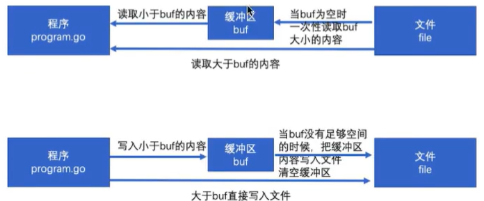

### I/O操作
I/O操作也叫做输入输出操作。其中I是指Input，O是指Output，用于读或者写数据的，有些语言中也叫做流操作，是指数据通信的通道。

### io包
io包提供了I/O原始操作的一系列接口。
在io包中最重要的是两个接口：Reader和Writer接口

#### Reader
```Go
type Reader interface {
    Read(p []byte) (n int, err error)
}
```
Reader接口用于包装基本的读取方法。

Read方法读取len(p)字节数据写入p。它返回写入的字节数和遇到的任何错误。即使Read方法返回值n < len(p)，本方法在被调用时仍可能使用p的全部长度作为暂存空间。如果有部分可用数据，但不够len(p)字节，Read按惯例会返回可以读取到的数据，而不是等待更多数据。

当Read在读取n > 0个字节后遭遇错误或者到达文件结尾时，会返回读取的字节数。它可能会在该次调用返回一个非nil的错误，或者在下一次调用时返回0和该错误。一个常见的例子，Reader接口会在输入流的结尾返回非0的字节数，返回值err == EOF或err == nil。但不管怎样，下一次Read调用必然返回(0, EOF)。调用者应该总是先处理读取的n > 0字节再处理错误值。这么做可以正确的处理发生在读取部分数据后的I/O错误，也能正确处理EOF事件。

如果Read的某个实现返回0字节数和nil错误值，表示被阻碍；调用者应该将这种情况视为未进行操作。

```
abcdefghijklmnop
```
```Go
package main

import (
	"fmt"
	"io"
	"os"
)

func main() {
	/*
		读取数据：
		Reader接口：
			Read(p []byte) (n int, error)
	*/
	// 读取本地文件中的数据
	// 1.打开文件
	fileName := "C:\\code_go\\test_io\\a.txt"
	file, err := os.Open(fileName)
	if err != nil {
		fmt.Println(err)
		return
	}
	// 3.关闭文件
	defer file.Close()
	// 2.读取数据
	bs := make([]byte, 4, 4)
	/*
		// 第一次读取
		n, err := file.Read(bs)
		if err != nil {
			fmt.Println(err)
			return
		}
		fmt.Println(n)
		fmt.Println(bs)
		fmt.Println(string(bs))
		// 第二次读取
		n, err = file.Read(bs)
		if err != nil {
			fmt.Println(err)
			return
		}
		fmt.Println(n)
		fmt.Println(bs)
		fmt.Println(string(bs))
	*/
	n := -1
	for {
		n, err = file.Read(bs)
		if n == 0 || err == io.EOF {
			fmt.Println("读取到了文件的末尾，结束读取操作")
			break
		}
		fmt.Println(string(bs[:n]))
	}
}
```
> abcd
> efgh
> ijkl
> mnop
> 读取到了文件的末尾，结束读取操作


#### Writer
```Go
type Writer interface {
    Write(p []byte) (n int, err error)
}
```
Writer接口用于包装基本的写入方法。

Write方法len(p) 字节数据从p写入底层的数据流。它会返回写入的字节数(0 <= n <= len(p))和遇到的任何导致写入提取结束的错误。Write必须返回非nil的错误，如果它返回的 n < len(p)。Write不能修改切片p中的数据，即使临时修改也不行。

```Go
package main

import (
	"fmt"
	"log"
	"os"
)

func main() {
	/*
		写出数据：
	*/
	fileName := "C:\\code_go\\test_io\\a.txt"
	// 1.打开文件
	file, err := os.OpenFile(fileName, os.O_RDWR|os.O_CREATE|os.O_APPEND, os.ModePerm)
	if err != nil {
		fmt.Println(err)
		return
	}
	// 3.关闭文件
	defer file.Close()
	// 2.写出数据
	bs := []byte{65, 66, 67, 68, 69, 70}
	n, err := file.Write(bs)
	fmt.Println(n)
	HandleError(err)

	// 写出字符串
	// 也可以通过file.Write([]byte("HelloWorld"))
	n, err = file.WriteString("HelloWorld")
	fmt.Println(n)
	HandleError(err)
}

func HandleError(err error) {
	if err != nil {
		log.Fatal(err)
	}
}
```
```
ABCDEFHelloWorld
```

### 文件复制
```Go
package main

import (
	"fmt"
	"io"
	"os"
)

func main() {
	/*
		拷贝文件
	*/
	srcFile := "C:\\code_go\\test_io\\a.txt"
	destFile := "C:\\code_go\\test_io\\b.txt"
	total, err := CopyFile1(srcFile, destFile)
	fmt.Println(total, err)
}

func CopyFile1(source string, dest string) (int, error) {
	srcFile, err := os.Open(source)
	if err != nil {
		return 0, err
	}
	destFile, err := os.OpenFile(dest, os.O_WRONLY|os.O_CREATE, os.ModePerm)
	if err != nil {
		return 0, err
	}
	defer srcFile.Close()
	defer destFile.Close()

	// 读写
	bs := make([]byte, 1024, 1024)
	n := -1    // 读取的数据量
	total := 0 // 写入的数据量
	for {
		n, err = srcFile.Read(bs)
		if n == 0 || err == io.EOF {
			fmt.Println("拷贝完毕")
			break
		} else if err != nil {
			fmt.Println("报错了")
			return total, err
		}
		total += n
		destFile.Write(bs[:n])
	}
	return total, nil
}

func CopyFile2(source string, dest string) (int64, error) {
	srcFile, err := os.Open(source)
	if err != nil {
		return 0, err
	}
	destFile, err := os.OpenFile(dest, os.O_WRONLY|os.O_CREATE, os.ModePerm)
	if err != nil {
		return 0, err
	}
	defer srcFile.Close()
	defer destFile.Close()
    /*
    Copy(dst, src)  复制src全部到dst中
    CopyN(dst, src, n)  复制src中n个字节到dst中
    CopyBuffer(dst, src, buf)   指定一个buf缓存区，以这个大小完全复制
    */
	return io.Copy(destFile, srcFile)
}
```

### 断点续传
#### Seek
```Go
type Seeker interface {
    Seek(offset int64, whence int) (int64, error)
}
```
Seeker接口用于包装基本的移位方法。

Seek方法设定下一次读写的位置：偏移量为offset，校准点由whence确定：0表示相对于文件起始；1表示相对于当前位置；2表示相对于文件结尾。Seek方法返回新的位置以及可能遇到的错误。

移动到一个绝对偏移量为负数的位置会导致错误。移动到任何偏移量为正数的位置都是合法的，但其下一次I/O操作的具体行为则要看底层的实现。


```
abcdefghij
```
```Go
package main

import (
	"fmt"
	"io"
	"log"
	"os"
)

func main() {
	/*
		Seek(offset int64, whence int) (int64, error)，设置光标的位置
			第一个参数：偏移量
			第二个参数：如何设置
				0：seekstart，表示相对于文件开始
				1：seekcurrent，相对于当前光标位置
				3：seekend，相对于文件末尾
	*/
	fileName := "C:\\code_go\\test_io\\a.txt"
	file, err := os.OpenFile(fileName, os.O_RDWR, os.ModePerm)
	if err != nil {
		log.Fatal(err)
	}
	defer file.Close()
	// 读写
	bs := []byte{0}
	file.Read(bs)
	fmt.Println(string(bs))

	file.Seek(4, io.SeekStart)
	file.Read(bs)
	fmt.Println(string(bs))
}
```
> a
> e

```Go
package main

import (
	"fmt"
	"io"
	"log"
	"os"
	"strconv"
	"strings"
)

func main() {
	/*
		断点续传：
			文件传递：文件复制
            目的：将"C:\\Users\\zhoumingzhen\\Pictures\\Saved Pictures\\photo_1.png"路径的图片复制到当前目录
			思路：边复制边记录复制的总量
	*/
	srcFile := "C:\\Users\\zhoumingzhen\\Pictures\\Saved Pictures\\photo_1.png"
	destFile := srcFile[strings.LastIndex(srcFile, "\\")+1:]
	fmt.Println(destFile)
	tempFile := destFile + "temp.txt"
	fmt.Println(tempFile)

	file1, err := os.Open(srcFile)
	HandleError(err)
	file2, err := os.OpenFile(destFile, os.O_WRONLY|os.O_CREATE, os.ModePerm)
	HandleError(err)
	file3, err := os.OpenFile(tempFile, os.O_RDWR|os.O_CREATE, os.ModePerm)
	HandleError(err)

	defer file1.Close()
	defer file2.Close()

	// 读取临时文件中的数据，再seek
	file3.Seek(0, io.SeekStart)
	bs := make([]byte, 100, 100)
	n1, err := file3.Read(bs)
	// HandleError(err)
	countStr := string(bs[:n1])
	count, err := strconv.ParseInt(countStr, 10, 64)
	// HandleError(err)
	fmt.Println(count)

	// 设置读，写位置
	file1.Seek(count, io.SeekStart)
	file2.Seek(count, io.SeekStart)
	data := make([]byte, 1024, 1024)
	n2 := -1 // 读取的数据量
	n3 := -1 // 写出的数据量
	total := int(count)

	// 复制文件
	for {
		n2, err = file1.Read(data)
		if n2 == 0 || err == io.EOF {
			fmt.Println("文件复制完毕")
			file3.Close()
            os.Remove(tempFile)
			break
		}
		n3, err = file2.Write(data[:n2])
		total += n3

		// 将复制的总量，存储到临时文件中
		file3.Seek(0, io.SeekStart)
		file3.WriteString(strconv.Itoa(total))
	}
}

func HandleError(err error) {
	if err != nil {
		log.Fatal(err)
	}
}
```

### bufio包
bufio是通过缓冲来提高效率
把文件读取进缓冲（内存）之后再读取的时候就可以避免文件系统的io，从而提高速度。同理在进行写操作的时候，先把文件写入缓冲（内存），然后由缓冲写入文件系统。


#### 读操作
bufio.Reader是bufio中对io.Reader的封装
`bufio.Read(p []byte)`相当于读取大小len(p)的内容：
1. 当缓存区有内容的时候，将缓存区内容全部填入p并清空缓存区
2. 当缓存区没有内容的时候且`len(p)>len(buf)`，即要读取的内容比缓存区还要大，直接去文件读取即可
3. 当缓存区没有内容的时候且`len(p)<len(buf)`，即要读取的内容比缓存区小，缓存区从文件读取内容充满缓存区，然后从缓存区读取内容将p填满（此时缓存区有剩余内容）
4. 以后再次读取时，缓存区有内容，将缓存区全部内容全部填入p并清空缓存区（此时和情况1一样）

```Go
package main

import (
	"fmt"
	"os"
)

func main() {
	/*
		bufio：高效io读写

		将io包下的Reader，Writer对象进行包装，带缓存的包装，提高读写的效率

		ReadBytes()
		ReadString()
		ReadLine()
	*/
	fileName := "C:\\Users\\zhoumingzhen\\Downloads\\poem.txt"
	file, err := os.Open(fileName)
	if err != nil {
		fmt.Println(err)
		return
	}
	defer file.Close()

	// 创建Reader对象
	//b1 := bufio.NewReader(file)

	// 1.Read()，高效读取
	//p := make([]byte, 100, 100)
	//n1, err := b1.Read(p)
	//fmt.Println(n1)
	//fmt.Println(string(p[:n1]))

	// 2.ReadLine()，不建议使用
	//data, flag, err := b1.ReadLine()
	//fmt.Println(flag)
	//if err != nil {
	//	fmt.Println(err)
	//	return
	//}
	//fmt.Println(string(data))

	// 3.ReadString()
	//for {
	//	s1, err := b1.ReadString('\n')
	//	if err == io.EOF {
	//		fmt.Println("读取完毕")
	//		break
	//	}
	//	fmt.Println(s1)
	//}

	// 4.ReadBytes()
	//data, err := b1.ReadBytes('\n')
	//if err != nil {
	//	fmt.Println(err)
	//	return
	//}
	//fmt.Println(string(data))

	// Scanner，读到空格就会停止读取
	//s2 := ""
	//fmt.Scanln(&s2)
	//fmt.Println(s2)

	// 可以读取键盘输入的空格
	//b2 := bufio.NewReader(os.Stdin)
	//s2, _ := b2.ReadString('\n')
	//fmt.Println(s2)

}
```

#### 写操作
bufio.Writer是bufio对io.Writer的封装
`bufio.Write(p []byte)`的思路：
1. 判断buf中可用容量是否可以放下p
2. 如果能放下，直接将p拼接到buf后面，即把内容放到缓存区
3. 如果缓存区的可用容量不足以放下，且此时缓冲区是空的，直接把p写入文件即可
4. 如果缓冲区的可用容量不足以放下，且此时缓冲区有内容，则用p将缓存区填满，把缓存区的所有内容写入文件，并清空缓存区
5. 判断p的剩余内容大小能否放到缓存区，如果能放下（此时和情况1一样），则把内容放到缓存区
6. 如果p的剩余内容依旧大于缓冲区（此时缓冲区是空的，情况和情况2一样），则把p的剩余内容直接写入文件

```Go
package main

import (
	"bufio"
	"fmt"
	"os"
)

func main() {
	fileName := "C:\\code_go\\test_io\\c.txt"
	file, err := os.OpenFile(fileName, os.O_CREATE|os.O_WRONLY, os.ModePerm)
	if err != nil {
		fmt.Println(err)
		return
	}
	defer file.Close()

	// 创建Writer对象
	w1 := bufio.NewWriter(file)
	n, err := w1.WriteString("hello world")
	if err != nil {
		fmt.Println(err)
		return
	}
	fmt.Println(n)
	w1.Flush() // 刷新缓冲区，将缓冲区的内容写到目标文件
}
```


### ioutil包
通过`import "io/ioutil"`进行导入