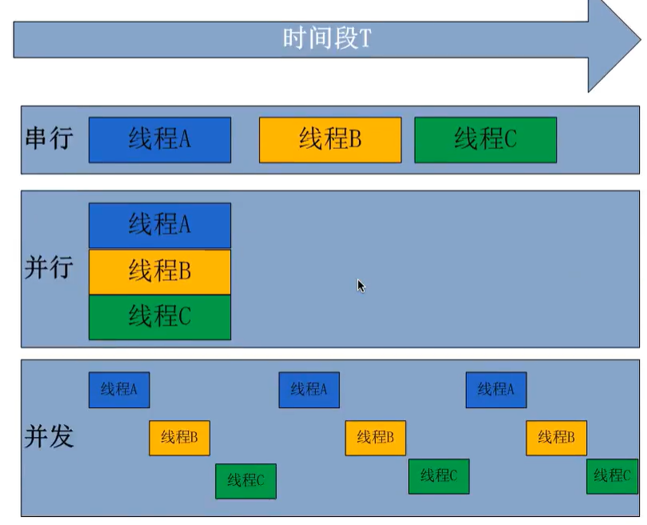
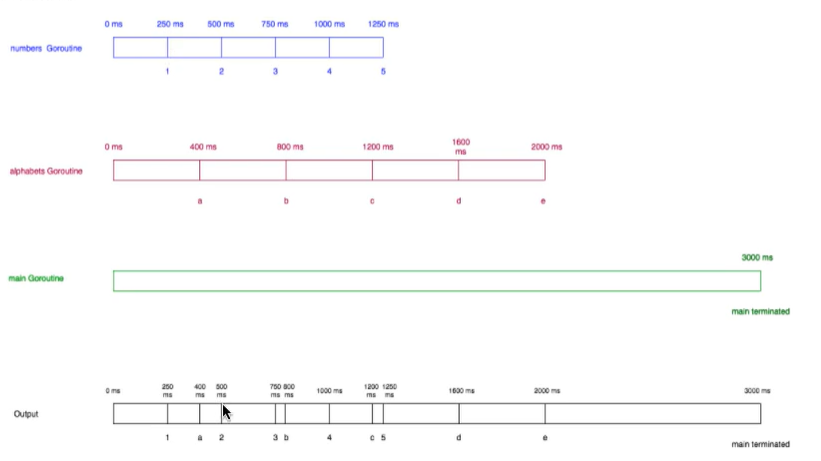
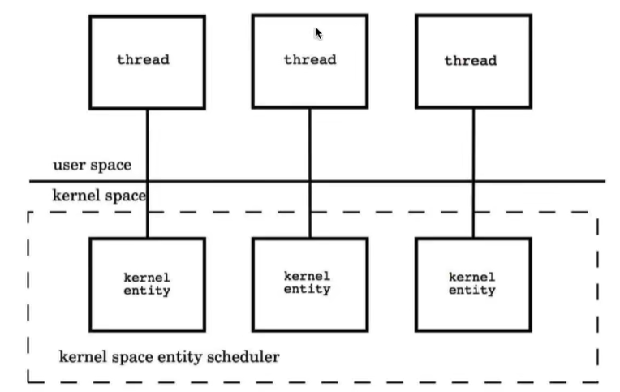
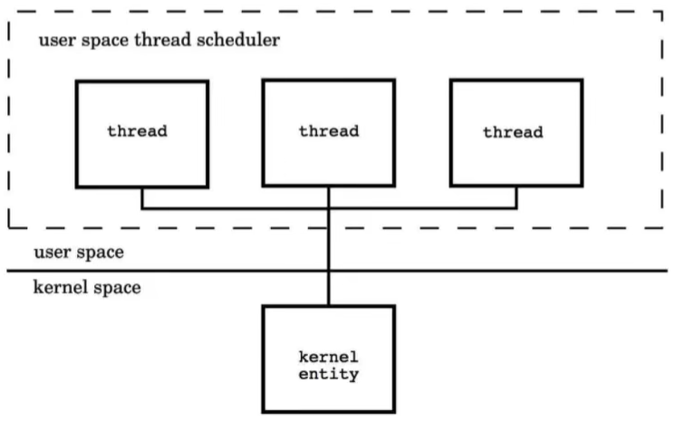
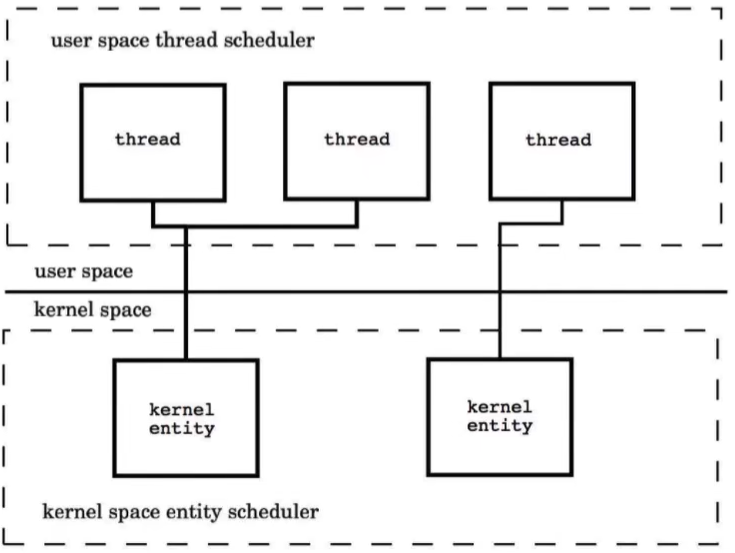
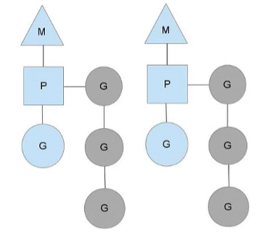
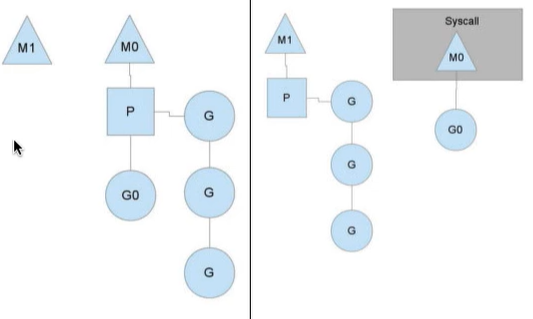
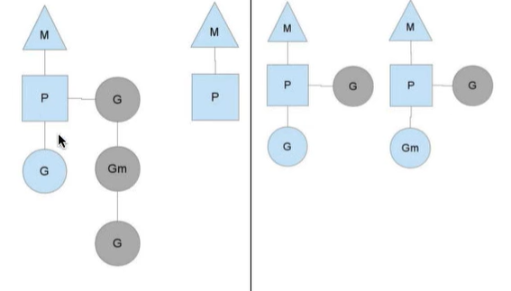

### 并发
Go是并发语言，而不是并行语言

**并发性**（Concurrency）是同时处理许多事情的能力
举个并发性的例子：假设一个人正在晨跑，在晨跑时，他的鞋带松了，现在这个人停止跑步，系鞋带，然后又开始跑步。这个人能够同时处理跑步和系鞋带，但是在同一时间点上只能做一个任务。
**并行性**（parallelism）是可以同时做很多事情的能力
同样是上面的例子：一个人正在晨跑，并且正在使用他的手机听音乐，在这种情况下，一个人一边慢跑一边听音乐，这就是他可以同时做很多事情。



### 进程、线程、协程
#### 进程（Process）
进程是一个程序在一个数据集中的一次动态执行过程，可以简单地理解为“正在执行的程序”，他是CPU资源分配和调度的独立单位。
进程一般由程序、数据集和进程控制块三部分组成：
- 程序用来描述进程要完成哪些功能以及如何完成
- 数据集则是程序在执行过程中所需要使用的资源
- 进程控制块用来记录进程的外部特征，描述进程的执行变化过程，系统可以利用它来控制和管理进程，它是系统感知进程存在的唯一标志

- 进程的局限是创建、撤销和切换的开销比较大


#### 线程（Thread）
线程也叫做轻量化进程，它是一个基本的CPU执行单元，也是程序执行过程中的最小单位，由线程ID、程序计数器、寄存器集合和堆栈共同组成。一个进程可以包含多个线程。
- 线程的优点是减少了程序并发执行时的开销，提高了操作系统的并发性能
- 缺点是线程没有自己的系统资源，只拥有在运行时必不可少的资源
- 同一进程的各个线程可以共享进程所拥有的系统资源


#### 协程（Coroutine）
协程是一种用户态的轻量级线程，又叫做微线程。协程的调度完全由用户控制。人们通常将协程与子程序（函数）比较着理解：
子程序调用总是一个入口，一次返回。一旦退出即完成了子程序的执行。
协程可以创建上百万个而不会导致系统资源衰竭，而线程和进程通常最多也不能超过一万的。

Go语言对于并发的实现是靠协程，Goroutine


### Goroutine
Goroutine区别于进程、线程和协程
Goroutine是与其他函数或方法同时运行的函数或方法。Goroutines可以被认为是轻量化的线程。与线程相比，创建Goroutine的成本很小，它就是一段代码，一个函数入口，以及在堆上为其分配的一个堆栈（初始大小为4K，会随程序的执行自动增长删除）。

#### 主Goroutine
封装main函数的goroutine就称为主goroutine。
主goroutine所做的事情并不是执行main函数这么简单。
- 它首先要设定每一个goroutine所能申请的栈空间的最大尺寸。在32位的计算机系统中此最大尺寸位250MB，而在64位的计算机系统中此最大尺寸为1GB。如果有某个goroutine的栈空间尺寸大于这个限制，那么运行时系统就会引发一个栈溢出（stack overflow）的运行时恐慌。随后，这个Go程序的运行也会终止。
- 然后，主goroutine会进行一系列的初始化工作：
    - 创建一个特殊的defer语句，用于在主goroutine退出时做必要的善后处理。因为主goroutine也可能非正常的结束。
    - 启动专用于在后台清扫内存垃圾的goroutine，并设置GC可用的标识
    - 执行main包中的init函数
    - 执行main函数
- 执行完main函数后，它还会检查主goroutine是否引发了运行时恐慌，并进行必要的处理。最后主goroutine会结束自己以及当前进程的运行


#### 使用Goroutine
在函数或方法（这些函数或方法往往没有返回值，有也一般会舍弃）调用前面加上关键字`go`，就会创建并运行一个新的Goroutine
```Go
package main

import (
	"fmt"
)

func countNum() {
	for i := 1; i <= 1000; i++ {
		fmt.Println("子Goroutine中打印数字：", i)
	}
}

func main() {
	// 先创建并启动子goroutine，执行countNum()
	go countNum()
	// main中打印字母
	for i := 1; i <= 1000; i++ {
		fmt.Println("a：", i)
	}
	fmt.Println("main结束")
}
```

#### Goroutine的规则
- 当新的Goroutine开始时，Goroutine调用立即返回。与函数不同，go不等待Goroutine执行结束。当Goroutine调用，并且Goroutine的任何返回值被忽略之后，go立即执行到下一行代码。
- main的Goroutine应该为其他的Goroutine执行。如果main的Goroutine终止了，程序将被终止，而其他Goroutine将不会运行。

```Go
package main

import (
	"fmt"
	"time"
)

func numbers() {
	for i := 1; i <= 5; i++ {
		time.Sleep(250 * time.Millisecond)
		fmt.Printf("%d ", i)
	}
}

func alphabets() {
	for i := 'a'; i <= 'e'; i++ {
		time.Sleep(400 * time.Millisecond)
		fmt.Printf("%c ", i)
	}
}

func main() {
	go numbers()
	go alphabets()
	time.Sleep(3000 * time.Millisecond)
	fmt.Println("done")
}
```
> 1 a 2 3 b 4 c 5 d e done
时间轴分析：


### 线程模型
在现代操作系统中，线程时处理器调度和分配的基本单位，进程则为资源拥有的基本单位。每一个进程至少有一个主执行线程，它无需由用户去主动创建，是由系统自动创建的。用户根据需要在应用程序中创建其他线程，多个线程并发地运行于同一个进程中。
操作系统根据资源访问权限的不同，体系架构可以分为用户空间和内核空间：
- 内核空间主要操作访问CPU资源、I/O资源、内存资源等硬件资源，为上层应用程序提供最基本的基础资源
- 用户空间就是上层应用程序的固定活动空间，用户空间不可以直接访问资源，必须通过“系统调用”、“库函数”或“Shell脚本”来调用内核空间提供的资源。

我们现在的计算机语言，可以狭义的认为是一种“软件”，他们中所谓的“线程”，往往是用户态的线程，和操作系统本身内核态的线程（KSE）是有区别的。

线程可以视为进程中的控制流。一个进程至少会包含一个线程。因而，一个进程的第一个线程会随着这个进程的启动而创建，这个线程就是进程的主线程。拥有多个线程的进程可以并发执行多个任务，并且即使某个或某些任务被阻塞，也不会影响其他任务正常执行，这可以大大改善程序的响应时间和吞吐量。另一方面，线程不可能独立于进程存在。它的生命周期不可能逾越其所属进程的生命周期。

线程的实现模型主要有3个：
- 用户级线程模型
- 内核级线程模型
- 两级线程模型

#### 内核级线程模型
用户线程（ULT）与KSE是1对1关系。大多数编程语言的线程库（如Java的java.lang.Thread，C++11的std::thread等等）都是对内核级线程的一层封装，创建出来的每个线程都与一个不同的KSE静态关联。因此其调度也完全由OS调度器来做。直接借助OS提供的线程能力，不同用户线程之间一般也不会相互影响，但是其创建、销毁以及多个线程之间的上下文切换等操作也都是直接由OS层面亲自来做，在需要使用大量线程的场景下对OS的性能影响会比较大。

每个线程由内核调度器独立的调度，所以如果一个线程阻塞并不影响其他的线程

优点：在多核处理器的硬件支持下，内核空间线程模型支持了真正的并行，当一个线程被阻塞后，允许另一个线程继续执行，所以并发能力比较强。
缺点：每创建一个用户级线程都需要创建一个内核级线程与其对应，这样创建线程的开销比较大，会影响应用程序的性能。

#### 用户级线程模型
用户线程与KSE是多对1关系，这种线程的创建、销毁以及多个线程之间的协调等操作都是由用户自己实现的线程库来负责，对OS内核透明，一个进程中创建的所有的线程都与同一个KSE在运行时动态关联。现在很多语言实现的协程都属于这种方式。这种方式相比内核级线程模型，对系统资源的消耗会小很多，因此可以创建的数量会更多，以及上下文切换所花费的代价也会小很多。但是如果我们在某个用户线程上调用阻塞式系统调用（如用阻塞方式read网络IO），那么一旦KSE因阻塞被内核调度出CPU的话，剩下的所欲的对应的用户线程全都会变为阻塞状态（整个进程挂起）。
所以这些语言的协程库通常会把自己的一些阻塞的操作重新封装为完全的非封装形式，然后在以前要阻塞的点上，主动让出自己，并通过某种方式通知或唤醒其他待执行的用户线程在该KSE上运行，从而避免内核调度器由于KSE阻塞而做上下文切换，从而阻塞整个进程。


优点：线程上下文切换都发生在用户空间，避免模态切换（mode switch），从而对于性能有积极的影响。
缺点：所有的线程基于一个内核调度实体即KSE，这意味着只有一个处理器可以被利用，在多处理器环境下这是不能接受的，本质上，用户线程只是解决了并发问题，但没有解决并行问题。

#### 两级线程模型
用户线程与KSE是多对多关系，这种实现综合了前两种模型的优点，为一个进程中创建多个KSE，并且线程可以与不同KSE在运行时进行动态关联，当某个KSE由于其上工作的线程的阻塞操作被内核调度出CPU时，当前与其关联的其余用户线程可以重新与其他KSE建立关联关系。但是这种动态关联机制的实现需要用户自己去实现。Go语言中的并发就是使用这种实现方式。这种模型也被称为混合型线程模型，即用户调度器实现用户线程到KSE的调度，内核调度器实现KSE到CPU上的调度。



### Go并发模型：G-P-M模型
Go语言支撑整个scheduler实现的主要有4个重要结构，分别是M、P、G、Sched，前三个定义在runtime.h中，Sched定义在proc.h中。
- Sched结构就是调度器，它维护有存储M和G的队列以及调度器的一些状态信息等。
- M结构就是Machine，系统线程，它由操作系统管理，goroutine就是跑在M上的。M是一个很大的结构，里面维护小对象内存cache（mcache）、当前执行的goroutine、随机数发生器等等非常多的信息。
- P结构是Processor，处理器，它的主要用途就是用来执行goroutine的，它维护了一个goroutine队列，即runqueue。Processor是让我们从N:1调度到N:M调度的重要部分。
- G结构是goroutine实现的核心结构，它包含了栈，指令指针，以及其他对调度goroutine很重要的信息，例如其阻塞的channel。

在单核处理器的场景下，所有goroutine运行在同一个M系统线程中，每一个M维护一个P，任何时刻，一个P中只有一个goroutine，其他goroutine在runqueue中等待。一个goroutine运行完自己的时间片之后，让出上下文，回到runqueue中。多核处理器的场景下，为了运行goroutine，每个M非持有一个P。

在正常的情况下，scheduler会按照上面的流程进行调度，但是线程会发生阻塞等情况。

#### 线程阻塞
当正在运行的goroutine阻塞时，例如进行系统调用，会再创建一个系统线程（M1），当前的M线程放弃了它的Processor，P转到新的线程中去运行。


#### runqueue执行完成
当其中一个Processor的runqueue为空，没有goroutine可以调度。它会从另外一个上下文偷取一半的goroutine。



### runtime包
```Go
package main

import (
	"fmt"
	"runtime"
	"time"
)

func init() {
	// 设置逻辑CPU的数量，返回值为上一次设置的数量（如果设置的数值小于1，不会改变当前的数值）（最好在程序运行之前设置，所以建议写在init函数中）
	n := runtime.GOMAXPROCS(runtime.NumCPU())
	fmt.Println(n)
}

func main() {
	// 获取goroot目录
	fmt.Println("GOROOT-->", runtime.GOROOT())
	// 获取当前操作系统
	fmt.Println("os/platform-->", runtime.GOOS)
	// 获取当前电脑中逻辑CPU的数量
	fmt.Println("逻辑CPU的数量-->", runtime.NumCPU())

	// Gosched，主动让出CPU
	//go func() {
	//	for i := 0; i < 20; i++ {
	//		fmt.Println("goroutine...")
	//	}
	//}()
	//
	//for i := 0; i < 10; i++ {
	//	// 让出时间片，先让别的goroutine执行
	//	runtime.Gosched()
	//	fmt.Println("main...")
	//}

	// Goexit，defer中的语句会执行
	// 创建goroutine
	go func() {
		fmt.Println("goroutine开始...")
		//调用fun
		fun()
		fmt.Println("goroutine结束...")
	}()
	time.Sleep(3 * time.Second)
}

func fun() {
	defer fmt.Println("defer...")
	//return // 终止函数，会打印"goroutine结束..."
	runtime.Goexit() // 终止当前的goroutine，不会打印"goroutine结束..."
	fmt.Println("fun...")
}
```


### 临界资源安全问题
#### 临界资源
指并发环境中多个进程/线程/协程共享的资源。
但是如果在并发编程中对临界资源的处理不当，往往会导致数据不一致的问题。

例：想在goroutine中打印a为2，在main中打印a为3，但是打印全都为2
```Go
package main

import (
	"fmt"
	"time"
)

func main() {
	/*
		临界资源
	*/
	a := 1
	go func() {
		a = 2
		fmt.Println(a)
	}()
	a = 3
	time.Sleep(1 * time.Second)
	fmt.Println(a)
}
```
> 2
> 2

如果多个goroutine在访问同一个数据资源的时候，其中一个线程修改了数据，那么这个数据就被修改了，对于其他的goroutine来说，这个数值可能是不对的。
例：通过并发来实现火车站售票的程序。一共有100张票，4个售票口同时出售。
```Go
package main

import (
	"fmt"
	"math/rand"
	"time"
)

// 全局变量，表示票
var ticket = 10 // 100张票

func main() {
	/*
		4个goroutine模拟4个售票窗口
	*/
	go saleTickets("售票口1")
	go saleTickets("售票口2")
	go saleTickets("售票口3")
	go saleTickets("售票口4")

	time.Sleep(5 * time.Second)
}

func saleTickets(name string) {
	rand.Seed(time.Now().UnixNano())
	for {
		time.Sleep(time.Duration(rand.Intn(1000)) * time.Millisecond)
		if ticket > 0 {
			fmt.Println(name, " 剩余票数：", ticket)
			ticket--
			fmt.Println(ticket)
		} else {
			fmt.Println(name, " 票买完了...")
			break
		}
	}
}
```

要想解决临界资源安全的问题，很多编程语言的解决方案都是同步。通过上锁的方式，某一时间段，只能允许一个goroutine来访问这个共享数据，当前goroutine访问完毕，解锁后，其他goroutine才能来访问。

==不要以共享内存的方式去通信，而要以通信的方式去共享内存。==

在Go语言中并不鼓励用锁保护共享状态的方式在不同的goroutine中分享信息（以共享内存的方式去通信）。而是鼓励通过channel将共享状态或共享状态的变化在各个goroutine之间传递（以通信的方式去共享内存）。


### sync包
```Go
package main

import (
	"fmt"
	"sync"
)

var wg sync.WaitGroup // 创建同步等待组的对象
func main() {
	/*
			WaitGroup：同步等待组
		Add()，设置等待组中要执行的子goroutine的数量
		Wait()，让主goroutine处于等待
	*/
	wg.Add(2)

	go fun1()
	go fun2()
	fmt.Println("main进入阻塞状态，等待wg中的子goroutine执行结束...")
	wg.Wait() // 表示main goroutine进入阻塞，当counter的值为0时解除阻塞
	fmt.Println("main阻塞解除")
}

func fun1() {
	defer wg.Done() // 给wg等待组中的counter数值减一
	for i := 0; i < 10; i++ {
		fmt.Println("fun1中打印----", i)
	}
}
func fun2() {
	defer wg.Done()
	for i := 0; i < 10; i++ {
		fmt.Println("fun2中打印----", i)
	}
}
```
```
main进入阻塞状态，等待wg中的子goroutine执行结束...
fun1中打印---- 0
...
fun2中打印---- 9
main阻塞解除
```


### 互斥锁
```Go
type Mutex struct {
    // 包含隐藏或非导出字段
}
```
Mutex是一个互斥锁，可以创建为其他结构体的字段；零值为解锁状态。Mutex类型的锁和线程无关，可以由不同的线程加锁和解锁。

```Go
package main

import (
	"fmt"
	"math/rand"
	"sync"
	"time"
)

// 全局变量，表示票
var ticket = 10 // 100张票

var mutex sync.Mutex  // 创建锁头
var wg sync.WaitGroup // 定义同步等待组对象

func main() {
	/*
		4个goroutine模拟4个售票窗口

		在使用互斥锁时，对资源操作完，一定要解锁，否则会出现死锁等问题
	*/
	wg.Add(4)
	go saleTickets("售票口1")
	go saleTickets("售票口2")
	go saleTickets("售票口3")
	go saleTickets("售票口4")
	wg.Wait()
	fmt.Println("程序结束了...")
}

func saleTickets(name string) {
	rand.Seed(time.Now().UnixNano())
	defer wg.Done()
	for {
		time.Sleep(time.Duration(rand.Intn(1000)) * time.Millisecond)
		// 上锁
		mutex.Lock()
		if ticket > 0 {
			fmt.Println(name, " 剩余票数：", ticket)
			ticket--
		} else {
			fmt.Println(name, " 票买完了...")
			mutex.Unlock() // 条件不满足也要解锁
			break
		}
		// 解锁
		mutex.Unlock()
	}
}
```


### 读写锁
```Go
type RWMutex struct {
    // 包含隐藏或非导出字段
}
```
RWMutex是读写互斥锁。该锁可以被同时多个读取者持有或唯一个写入者持有。RWMutex可以创建为其他结构体的字段；零值为解锁状态。RWMutex类型的锁也和线程无关，可以由不同的线程加读取锁/写入和解读取锁/写入锁。

- 同时只能有一个goroutine能够获得写锁定。
- 可以同时有任意多个goroutine获得读锁定
- 同时只能存在写锁定或读锁定（读和写互斥）

```Go
package main

import (
	"fmt"
	"sync"
	"time"
)

var rwMutex *sync.RWMutex
var wg *sync.WaitGroup

func main() {
	rwMutex = new(sync.RWMutex)
	wg = new(sync.WaitGroup)

	// 多个goroutine读操作可以同时进行
	//wg.Add(2)
	//go readData(1)
	//go readData(2)
	/*
	运行结果：
	2 开始读：...
	2 正在读数据...
	1 开始读：...
	1 正在读数据...
	1 读操作结束...
	2 读操作结束...
	程序执行结束...
	*/

	// 写锁定时，不能有其他goroutine有写锁定或读锁定
	wg.Add(3)
	go writeData(1)
	go readData(2)
	go writeData(3)
	/*
	运行结果：
	1 开始写...
	1 正在写数据...
	2 开始读...
	3 开始写...
	1 写操作结束...
	2 正在读数据...
	2 读操作结束...
	3 正在写数据...
	3 写操作结束...
	程序执行结束...
	*/

	wg.Wait()
	fmt.Println("程序执行结束...")
}

func writeData(i int) {
	defer wg.Done()
	fmt.Println(i, "开始写...")
	rwMutex.Lock() // 写操作上锁
	fmt.Println(i, "正在写数据...")
	time.Sleep(1 * time.Second)
	rwMutex.Unlock()
	fmt.Println(i, "写操作结束...")
}
```


### Channel
Channel（通道）可以被认为是Goroutines通信的管道。类似于管道中的水从一端到另一端的流动，数据可以从一端发送到另一端，通过通道接收。
在Go语言中，要传递某个数据给另一个goroutine，可以把这个数据封装成一个对象，然后把这个对象的指针传入某个channel中，另外一个goroutine从这个channel中读出这个指针，并处理其指向的内存对象。

#### 通道
通道就是goroutine之间的通道。它可以让goroutine之间可以相互通信。
每个通道都有与其相关的类型。该类型是通道允许传输的数据类型。（通道的零值为nil。nil通道没有任何用处，因此通道必须使用类似map和slice的方法来定义。）

#### 通道的声明
声明一个通道和定义一个变量的语法一样：
```Go
// 声明通道
var 通道名 chan 数据类型
// 创建通道：如果通道为nil（不存在），就需要先创建通道
通道名 = make(chan 数据类型)
```

```Go
package main

import "fmt"

func main() {
	var a chan int
	test1(a) // chan int,<nil>


	if a == nil {
		fmt.Println("a is nil")
		a = make(chan int)
		test1(a) // chan int,0xc0000184d0
	}
}

func test1(ch chan int) {
	fmt.Printf("%T,%v\n", ch, ch)
}
```

#### 通道的使用语法
==channel本身是同步的，所以意味着在同一时间，只能有一条goroutine来操作==
==通道是goroutine之间的连接，所以通道的发送和接收必须处在不同的goroutine中==

##### 发送和接收
语法：在通道上箭头的方向指定数据是发送还是接收。
```Go
data := <- a // 从通道a读取数据
a <- data // 将数据写入通道a
```

```Go
package main

import "fmt"

func main() {
	var ch1 chan bool = make(chan bool)

	go func() {
		defer fmt.Println("子goroutine结束...")
		for i := 0; i < 10; i++ {
			fmt.Println("子goroutine，i：", i)
		}
		// 循环结束后，向通道中写数据，表示要结束了
		// 发送数据是阻塞的，直到另一条goroutine读取数据来解除阻塞
		ch1 <- true
	}()
	// 读取数据是阻塞的，直到另一个goroutine写出数据接触阻塞
	data := <-ch1
	fmt.Println("main...data-->", data)
	fmt.Println("main结束...")
}
```
```
子goroutine，i： 0
子goroutine，i： 1
子goroutine，i： 2
子goroutine，i： 3
子goroutine，i： 4
子goroutine，i： 5
子goroutine，i： 6
子goroutine，i： 7
子goroutine，i： 8
子goroutine，i： 9
子goroutine结束...
main...data--> true
main结束...
```


一个通道发送和接收数据，默认是阻塞的。当一个数据被发送到通道时，在发送语句中被阻塞，直到另一个goroutine从该通道读取数据。相对的，当从通道读取数据时，读取被阻塞，直到一个goroutine将数据写入该通道。
```Go
package main

import "fmt"

func main() {
	ch1 := make(chan int)

	go func() {
		fmt.Println("子goroutine开始执行...")
		data := <-ch1 // 从ch1中读取数据
		fmt.Println("data: ", data)
	}()

	ch1 <- 10
	fmt.Println("main结束...")
}
```

#### 死锁
使用通道时要考虑的一个重要因素就是死锁。如果goroutine在一个通道上发送数据，那么预计其他的goroutine应该接收数据。如果这种情况不发生，那么程序将在运行时发生死锁。类似的，如果goroutine正在等待从通道接收数据，那么另一些goroutine将会在该通道上写入数据，否则程序将会死锁。
```Go
package main

func main() {
	ch := make(chan int)
	ch <- 5
}
```
报错：
```
fatal error: all goroutines are asleep - deadlock!

goroutine 1 [chan send]:
main.main()
        C:/code_go/test_Goroutine/test12/main.go:5 +0x28
exit status 2
```

#### 关闭通道
发送者可以通过关闭通道，来通知接收方不会有更多的数据被发送到channel上。
```Go
close(ch)
```
接收者可以在接收来自通道的数据时使用额外的变量来检查通道是否已经关闭。
```Go
v, ok := <- ch
```
如果ok的值为true，表示成功从通道中读取了一个数据value，如果ok是false，这意味着我们正从一个封闭的通道读取数据。从封闭通道读取的值将是通道类型的零值。
例：如果通道是一个int通道，那么从封闭通道中获取的value就是0.

```Go
package main

import (
	"fmt"
)

func main() {
	/*
		关闭通道：close(ch)
			子goroutine：写出10个数据
				每写一个，阻塞一次，主goroutine读取一次，解除阻塞
			主goroutine：读取数据
				每次读取数据，阻塞一次，子goroutine，写出一个解除阻塞
	*/
	ch1 := make(chan int)
	go sendData(ch1)
	// 读取通道中的数据
	for {
		v, ok := <-ch1
		if !ok {
			fmt.Println("已经读取了所有的数据...")
			break
		}
		fmt.Println("读取的数据是", v)
	}

	fmt.Println("main结束...")
}

func sendData(ch1 chan int) {
	// 发送方：10条数据
	for i := 0; i < 10; i++ {
		ch1 <- i // 将i写入到通道中
	}
	close(ch1)
}
```
```
读取的数据是 0
读取的数据是 1
读取的数据是 2
读取的数据是 3
读取的数据是 4
读取的数据是 5
读取的数据是 6
读取的数据是 7
读取的数据是 8
读取的数据是 9
已经读取了所有的数据...
main结束...
```

#### 通道上的范围循环
我们可以循环从通道上获取数据，直到通道关闭。for循环的for range形式可用于从通道接收值，直到它关闭为止。
```Go
package main

import "fmt"

func main() {
	ch1 := make(chan int)
	go sendData(ch1)
	// v <- ch1
	for v := range ch1 {
		fmt.Println("读取数据：", v)
	}
	fmt.Println("main结束...")
}

func sendData(ch1 chan int) {
	for i := 0; i < 10; i++ {
		ch1 <- i
	}
	close(ch1)
}
```
```
读取数据： 0
读取数据： 1
读取数据： 2
读取数据： 3
读取数据： 4
读取数据： 5
读取数据： 6
读取数据： 7
读取数据： 8
读取数据： 9
main结束...
```


### 缓冲通道
前面所说的通道都是非缓冲通道。发送和接收到一个非缓冲的通道是阻塞的。

*缓冲通道*就是指一个铜带，带有一个缓冲区。发送到一个缓冲通道只有在缓冲区满时才被阻塞。类似的，从缓冲通道接收的数据也只有在缓冲区为空时才会被阻塞。
可以通过将额外的容量参数传递给make函数来创建缓冲通道，该函数指定缓冲区的大小。

语法：
```Go
ch := make(chan type, capacity)
```
上述语法的容量应该大于0，以便通道具有缓冲区。默认情况下，无缓冲通道的容量为0，因此在之前创建通道时省略了容量参数。

```Go
package main

import (
	"fmt"
	"strconv"
)

func main() {
	ch1 := make(chan int)           // 非缓冲通道
	fmt.Println(len(ch1), cap(ch1)) // 0 0

	ch2 := make(chan int, 5)        // 缓冲通道（先进先出）
	fmt.Println(len(ch2), cap(ch2)) // 0 5

	ch2 <- 100
	fmt.Println(len(ch2), cap(ch2)) // 1 5

	ch3 := make(chan string, 4)
	go sendData(ch3)
	for {
		v, ok := <-ch3
		if !ok {
			fmt.Println("读取结束...")
			break
		}
		fmt.Println("\t读取的数据是：", v)
	}
	fmt.Println("main结束...")
}

func sendData(ch chan string) {
	for i := 0; i < 10; i++ {
		ch <- "数据" + strconv.Itoa(i)
		fmt.Printf("子goroutine写出第%d个数据\n", i)
	}
	close(ch)
}
```
```
0 0
0 5
1 5
子goroutine写出第0个数据
子goroutine写出第1个数据
子goroutine写出第2个数据
子goroutine写出第3个数据
子goroutine写出第4个数据
        读取的数据是： 数据0
        读取的数据是： 数据1
        读取的数据是： 数据2
        读取的数据是： 数据3
        读取的数据是： 数据4
        读取的数据是： 数据5
子goroutine写出第5个数据
子goroutine写出第6个数据
子goroutine写出第7个数据
子goroutine写出第8个数据
子goroutine写出第9个数据
        读取的数据是： 数据6
        读取的数据是： 数据7
        读取的数据是： 数据8
        读取的数据是： 数据9
读取结束...
main结束...
```
问题：为什么会连续输出五次子goroutine输出语句
答：因为在子goroutine往通道写入0，1，2，3后，通道满了，子goroutine想继续写入数据4，但是通道已经阻塞，但是主goroutine这时读取了数据0，然后还没来得及输出main的输出语句，就又被子goroutine抢走了时间片，所以这时通道的阻塞已经解除，子goroutine写入数据4，并执行输出语句，然后主goroutine才夺回时间片，执行输出语句。


### 定向通道
前面所学习的通道都是双向通道，既可以发送数据，也可以读取数据。
单向通道，也就是*定向通道*，这些通道只能发送或接收数据。

==通常是用于限制原本是双向的通道在函数或方法中只读或只写。==
```Go
package main

import (
	"fmt"
)

func main() {
	/*
		单向通道：定向通道
		chan <- T，只支持写
		<- chan T，只支持读
	*/
	ch1 := make(chan int) // 双向，读，写
	//ch2 := make(chan<- int) // 单向，只能写不能读
	//ch3 := make(<-chan int) // 单向，只能读不能写

	//ch1 <- 100
	//data := <-ch1
	//fmt.Println(data)

	//ch2 <- 100
	//data = <-ch2 // invalid operation: cannot receive from send-only channel ch2 (variable of type chan<- int)

	//data = <-ch3
	//ch3 <- 200 // invalid operation: cannot send to receive-only channel ch3 (variable of type <-chan int)

	go fun1(ch1) // 只写
	data := <-ch1
	fmt.Println("fun1函数写出的数据是：", data)

	go fun2(ch1)
	ch1 <- 200

	fmt.Println("main结束...")
}

func fun1(ch chan<- int) {
	ch <- 100
	fmt.Println("fun1函数结束...")
}

func fun2(ch <-chan int) {
	data := <-ch
	fmt.Println("fun2函数从ch中读取的数据是：", data)
}
```
> fun1函数写出的数据是： 100
> fun1函数结束...
> fun2函数从ch中读取的数据是： 200
> main结束...


### Timer
主要是定时器，标准库的Timer让用户可以定义自己的超时逻辑，尤其是在应对select处理多个channel的超时、单channel读写的超时等情形时尤为方便。
Timer是一次性的时间触发事件，这点与Ticker不同，Ticker是按一定时间间隔触发时间事件。
```Go
type Timer struct {
    C <-chan Time
    // 内含隐藏或非导出字段
}
```
Timer类型代表单次时间事件。当Timer到期时，当时的时间会被发送给C，除非Timer是被AfterFunc函数创建的。

Timer常见的创建方式：
```Go
t := time.NewTimer(d) // 返回一个Timer指针，它会在最少过去时间段d后到期，向其自身的字段C发送当前的时间
t := time.AfterFunc(d, f) // 返回一个Timer指针，会另起一个goroutine等待时间段d过去，然后调用f。可以调用Stop方法来取消等待和对f的调用
c := time.After(d) // 返回一个单向读通道 会在另一个线程经过时间段d后向返回值发送当时的时间。等价于NewTimer(d).C 
```
Timer有3个要素：
- 定时时间：d
- 触发动作：f
- 时间channel：t.C

注意：
- 定时器在创建时就已经开始计时
- 定时器会在设定的时间段d后触发，并立即向通道发送值，若没有goroutine读取，该值会一直缓存在通道里，但程序可能正常退出

```Go
package main

import (
	"fmt"
	"time"
)

func main() {
	//// 创建一个定时器，d时间后触发
	//timer := time.NewTimer(3 * time.Second)
	//fmt.Println(time.Now())
	//
	//// 此处等待channel中的数值，会阻塞3秒
	//ch2 := timer.C
	//fmt.Println(<-ch2)

	//// 新建一个定时器
	//timer2 := time.NewTimer(5 * time.Second)
	//// 开始goroutine，来处理触发后的事件
	//go func() {
	//	<-timer2.C
	//	fmt.Println("timer2结束了...")
	//}()
	//
	//time.Sleep(3 * time.Second)
	//flag := timer2.Stop()
	//if flag {
	//	fmt.Println("timer2停止了...")
	//}

	/*
		func After(d Duration) <-chan Time
			返回一个通道：存储的是d时间之后的当前时间
	*/
	ch := time.After(3 * time.Second)
	fmt.Println(time.Now())

	time2 := <-ch
	fmt.Println(time2)
}
```


### select语句
select是Go中的一个控制结构。select语句类似于switch语句，但是select会随机执行一个可运行的case。如果没有case可运行，它将阻塞，直到有case可运行。

语法：
```Go
select {
	case communication clause:
		statement(s)
	case communication clause:
		statement(s)
	default: // 可选
		statement(s)
}
```
- 每个case都必须是一个通信
- 所有channel表达式都会被求值
- 所有被发送的表达式都会被求值
- 如果有多个case都可以运行，select会随机公平地选出一个执行。其他不会执行
- 如果没有case可以运行：
    - 如果有default，则执行该语句
    - 如果没有default，select将阻塞，直到某个通信可以运行。Go不会重新对channel或值进行求值

```Go
package main

import (
	"fmt"
	"time"
)

func main() {
	/*
		select语句：
		select类似于switch语句，但是select语句会随机执行一个可运行的case
		如果没有case可以运行，要看是否有default，如果有就运行default，否则就进入阻塞，直到有case可以运行
	*/
	ch1 := make(chan int)
	ch2 := make(chan int)

	go func() {
		time.Sleep(1 * time.Second)
		ch1 <- 100
	}()

	go func() {
		time.Sleep(1 * time.Second)
		ch2 <- 200
	}()

	select {
	case num1 := <-ch1:
		fmt.Println("ch1中获取的数据：", num1)
	case num2, ok := <-ch2:
		if ok {
			fmt.Println("ch2中读取的数据：", num2)
		} else {
			fmt.Println("ch2通道已经关闭")
		}
	case <-time.After(2 * time.Second):
		//default:
		//	fmt.Println("default执行")
	}

	fmt.Println("main结束...")
}
```

```Go
package main

import (
	"fmt"
	"time"
)

func main() {
	/*
	所有被发送的表达式都会被求值：
	select 语句在开始选择可执行的分支之前，会先计算所有 case 中发送操作（ch <- expr）的 expr。
	如果某个 case 被选中，对应的发送或接收操作会执行。
	未被选中的 case 的表达式仍会被求值，但对应的通道操作不会执行。
	*/
	ch1 := make(chan int)
	ch2 := make(chan int)

	// 定义两个函数，返回发送到通道的值
	valueForCh1 := func() int {
		fmt.Println("计算 ch1 的值")
		return 1
	}
	valueForCh2 := func() int {
		fmt.Println("计算 ch2 的值")
		return 2
	}

	go func() {
		time.Sleep(1 * time.Second) // 确保 ch2 先就绪
		ch2 <- 3
	}()

	// select 语句
	select {
	case ch1 <- valueForCh1(): // 表达式会被求值，但发送可能不执行
		fmt.Println("发送到 ch1")
	case ch2 <- valueForCh2(): // 表达式会被求值，但发送可能不执行
		fmt.Println("发送到 ch2")
	default:
		fmt.Println("默认分支")
	}
}
```
> 计算 ch1 的值
> 计算 ch2 的值
> 发送到 ch2
