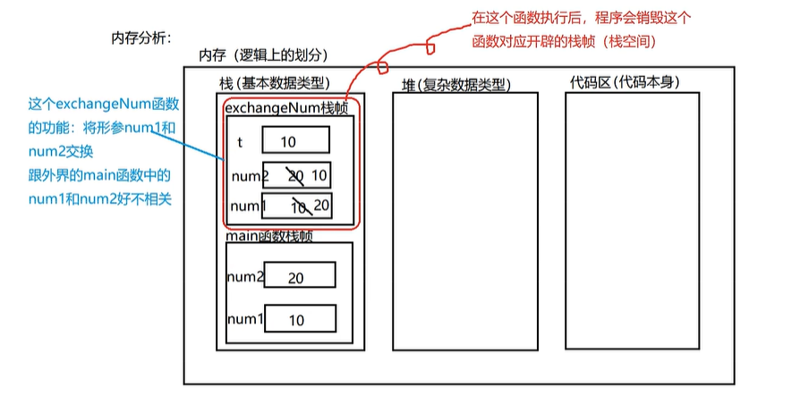

### 函数
作用：提高代码的复用，减少代码的冗余，提高代码的维护性

### 基础语法
基本语法：
```Go
func 函数名 (形参列表) (返回值类型列表) {
    函数执行语句...
    return + 返回值列表
}
```
- 函数名：
    - 遵循标识符命名规范
    - 首字母不能是数字
    - 首字母大写该函数可以导出（可以被本包和其他包文件使用）
    - 首字母小写则该函数不能导出（只可以被本包文件使用）
- 形参列表：
    - 可以是一个参数，也可以是n个，也可以是0个
    - 多个函数之间通过`,`进行分隔，相同类型的形参可以合并，如`func f(x, y int) {}`
- 返回值类型列表：函数的返回值的类型要写在该列表中
    - 返回0个：返回值类型列表可以省略（相当于void）
    - 返回1个：返回值类型列表的`()`可以省略不写
    - 返回多个：多个返回值类型通过`,`进行分隔
- 接收返回值时，如果不想接收返回值，可以利用`_`进行接收

函数的类型被称为*函数的签名*。如果两个函数形式参数列表和返回值列表中的变量类型一一对应，那么这两个函数被认为有相同的类型或签名。形参和返回值的变量名不影响函数签名，也不影响它们是否可以以省略参数类型的形式表示。

每一次函数调用都必须按照声明顺序为所有参数提供实参（参数值）。在函数调用时，Go语言没有默认参数值，也没有任何方法可以通过参数名指定形参，因此形参和返回值的变量名对于函数调用者而言没有意义。

在函数体中，函数的形参作为局部变量，被初始化为调用者提供的值。函数的形参和有名返回值作为函数最外层的局部变量，被存储在相同的词法块中。

==实参通过值的方式传递（值传递），因此函数的形参是实参的拷贝。对形参进行修改不会影响实参。==但是，如果实参包括引用类型，如指针，slice(切片)、map、function、channel等类型，实参可能会由于函数的间接引用被修改。


#### 函数的内存分析



#### 注意
- ==Go语言中函数不支持重载==
- 函数和函数是并列的关系，所以我们定义的函数不能写到main函数中

- Go语言中支持可变参数（函数的参数为：可变参数 `...`），如`func f(nums...int) {}`
    - 在函数内部处理可变参数时，将可变参数当作Slice进行处理
```Go
package main

import "fmt"

func cal(nums ...int) (sum int, sub int) {
	sum = nums[0] + nums[1]
	sub = nums[0] - nums[1]
	return
}

func main() {
	fmt.Println(cal(10, 20))
}
```
> 30 -10

- 在Go语言中，函数也是一种数据类型，可以赋值给一个变量，则该变量就是一个函数类型的变量了，通过该变量可以对函数进行调用
    - 函数也可以作为形参，并且调用
```Go
package main

import "fmt"

func cal(x, y int) (int, int) {
	var sum = x + y
	var result = x - y
	return sum, result
}

func main() {
	f := cal
	fmt.Println(f(10, 20))
}
```
> 30 -10

- 可以给函数声明类型（相当于起一个别名），如：`type f func(nums...int) (int, int) {}`
```Go
package main

import "fmt"

type myFunc func(int, int) (int, int)

func cal(x, y int) (sum int, sub int) {
	sum = x + y
	sub = x - y
	return
}

func main() {
	var f myFunc
	f = cal
	fmt.Println(f(10, 20))
}
```
> 30 -10

- 支持对函数返回值进行命名
```Go
package main

import "fmt"

func cal(x, y int) (sum int, sub int) {
	sum = x + y
	sub = x - y
	return
}

func main() {
	fmt.Println(cal(10, 20))
}
```
> 30 -10


#### init函数
初始化函数，可以用来进行一些初始化的操作。init函数在包被导入时会自动执行，而不需要手动调用。
- 当导入一个包时，其中的 init 函数会在包的所有其他函数之前被执行。这意味着在使用包中的其他函数之前，包的初始化工作会首先完成。
- 如果同一个包被多次导入，其中的 init 函数只会执行一次。这是因为 init 函数在整个程序生命周期内只会被执行一次，即使导入它的包被多次引用也不会重复执行。这确保了包的初始化逻辑只会执行一次，避免了重复的初始化工作和可能的副作用。

#### 执行顺序
- ==每一个源文件都可以包含一个或多个init函数，该函数会在main函数执行前，被Go运行框架调用==
```Go
package main

import "fmt"

func init() {
	fmt.Println("调用init函数")
}

func main() {
	fmt.Println("调用main函数")
}
```
> 调用init函数
> 调用main函数

- 先进行全局变量的定义，再调用init函数，最后调用main函数
```Go
package main

import "fmt"

var num int = test()

func test() int {
	fmt.Println("调用test函数")
	return 10
}

func init() {
	fmt.Println("调用init函数")
}

func main() {
	fmt.Println("调用main函数")
}
```
> 调用test函数
> 调用init函数
> 调用main函数


- 当包导入时，会先调用导入的包中的init函数进行初始化
```Go
// basis/test1/test_pkg/test_init.go
package test_pkg

import "fmt"

var Age int
var Gender string
var Name string

func init() {
	fmt.Println("调用test_pkg中的init函数")
	Age = 20
	Gender = "男"
	Name = "张三"
}
```

```Go
// main.go
package main

import (
	"basis/test1/test_pkg"
	"fmt"
)

var num int = test()

func test() int {
	fmt.Println("调用test函数")
	return 10
}

func init() {
	fmt.Println("调用main.go中的init函数")
}

func main() {
	fmt.Println("调用main函数")
	fmt.Println("Age: ", test_pkg.Age, "Gender: ", test_pkg.Gender, "Name: ", test_pkg.Name)
}
```
> 调用test_pkg中的init函数
> 调用test函数
> 调用main.go中的init函数
> 调用main函数
> Age:  20 Gender:  男 Name:  张三


### 匿名函数
使用场合：如果我们希望某个函数只是使用一次，可以考虑使用匿名函数

#### 使用方式
- 在定义匿名函数时就直接使用，这种方式匿名函数只能调用一次
```Go
package main

import "fmt"

func main() {
	// 定义匿名函数
	result := func(num1, num2 int) int {
		return num1 + num2
	}(10, 20)
	fmt.Println(result)
}
```
> 30

- 将匿名函数赋给一个变量（该变量就是一个函数变量了），再通过该变量调用匿名函数
    - 将匿名函数赋给一个全局变量就可以让匿名函数在整个程序中有效（不如直接定义函数）
```Go
package main

import "fmt"

func main() {
	// 定义匿名函数
	sum := func(num1, num2 int) int {
		return num1 + num2
	}
	result := sum(10, 20)
	fmt.Println(result)
}
```
> 30


### 闭包
闭包就是一个函数和与其相关的引用环境组合的一个整体
例：
```Go
package main

import "fmt"

// getSum函数返回值为一个函数，这个函数的参数是一个int类型的参数，返回值也是int类型
func getSum() func(int) int {
	var sum int = 0
	return func(num int) int {
		sum = sum + num
		return sum
	}
}

// 闭包：返回的匿名函数+匿名函数以外的变量sum

func main() {
	f := getSum()
	fmt.Println(f(1))
	fmt.Println(f(2))
	fmt.Println(f(3))
}
```
> 1
> 3
> 6

- 闭包的本质：
闭包的本质依旧是一个匿名函数，只是这个函数引入外界的变量/参数
匿名函数+引用的变量/参数 = 闭包

- 特点：
    - 返回的是一个匿名函数，但是这个匿名函数引用到了函数外的变量/参数，因此这个匿名函数就和变量/参数形成一个整体，构成闭包
    - 闭包中使用的变量/参数会一直保存在内存中，所以会一直使用（==闭包不可滥用，可能导致内存泄漏==）

- 闭包的作用场景：
闭包可以保留上次引用的某个值，我们传入一次就可以反复使用了


### defer关键字
```Go
package main

import "fmt"

func add(num1, num2 int) int {
	// 在Go语言中，程序遇到defer关键字，不会立即执行defer后的语句，而是将defer后的语句压入一个栈中，然后继续执行函数后面的语句
	defer fmt.Println("num1=", num1)
	defer fmt.Println("num2=", num2)
	// 栈的特点是FILO，在函数执行完毕以后，从栈中取出语句开始执行，按照先进后出的规则执行语句
	var sum int = num1 + num2
	fmt.Println("sum=", sum)
	return sum
}

func main() {
	fmt.Println(add(10, 20))
}
```
> sum= 30
> num2= 20
> num1= 10
> 30

- 遇到defer关键字，会将后面的代码语句压入栈中，也会将相关的值同时拷贝入栈中，不会随着函数后面的变化而变化
```Go
package main

import "fmt"

func add(num1, num2 int) int {
	// 在Go语言中，程序遇到defer关键字，不会立即执行defer后的语句，而是将defer后的语句压入一个栈中，然后继续执行函数后面的语句
	defer fmt.Println("num1=", num1)
	defer fmt.Println("num2=", num2)
	num1 += 10
	num2 += 20
	// 栈的特点是FILO，在函数执行完毕以后，从栈中取出语句开始执行，按照先进后出的规则执行语句
	var sum int = num1 + num2
	fmt.Println("sum=", sum)
	return sum
}

func main() {
	fmt.Println(add(10, 20))
}
```
> sum= 60
> num2= 20
> num1= 10
> 60

defer语句中的函数会在return语句更新返回值变量后再执行，又因为在函数中定义的匿名函数可以访问该函数包括返回值变量在内的所有变量，所以，对匿名函数采用defer机制，可以使其观察函数的返回值。
以double函数为例：我们只需要首先命名double的返回值，再增加defer语句，我们就可以在double每次被调用时，输出参数以及返回值。
```Go
func double(x int) (result int) {
    defer func() { fmt.Printf("double(%d) = %d\n", x,result) }()
    return x + x
}
_ = double(4)
```
> double(4) = 8

被延迟执行的匿名函数甚至可以修改函数返回给调用者的返回值
```Go
func triple(x int) (result int) {
    defer func() { result += x }()
    return double(x)
}
fmt.Println(triple(4)) // "12"
```

- 应用场景：
在想关闭某个使用的资源，在使用的时候直接defer，因为defer有延迟执行机制（函数执行完毕后再执行defer压入栈的语句），所以可以用完直接关闭


### 内置函数
不需要导入包也可以直接使用的函数
内置函数存放在builtin包下

常用函数：
- len函数：
`func len(v Type) int`
内建函数len返回 v 的长度，这取决于具体类型：
- 数组：v中元素的数量
- 数组指针：*v中元素的数量（v为nil时panic）
- 切片、映射：v中元素的数量；若v为nil，len(v)即为零
- 字符串：v中字节的数量
- 通道：通道缓存中队列（未读取）元素的数量；若v为 nil，len(v)即为零

- new函数：
`func new(Type) *Type`
内建函数new分配内存。其第一个实参为类型，而非值。其返回值为指向该类型的新分配的零值的指针。

- make函数：
`func make(Type, size IntegerType) Type`
内建函数make分配并初始化一个类型为切片、映射、或通道的对象。其第一个实参为类型，而非值。make的返回类型与其参数相同，而非指向它的指针。其具体结果取决于具体的类型：
- 切片：size指定了其长度。该切片的容量等于其长度。切片支持第二个整数实参可用来指定不同的容量；它必须不小于其长度，因此 make([]int, 0, 10) 会分配一个长度为0，容量为10的切片。
- 映射：初始分配的创建取决于size，但产生的映射长度为0。size可以省略，这种情况下就会分配一个
小的起始大小。
- 通道：通道的缓存根据指定的缓存容量初始化。若 size为零或被省略，该信道即为无缓存的。