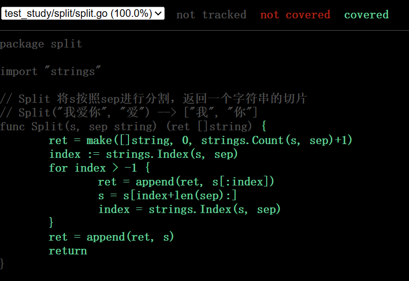

### go test工具
Go语言中的测试依赖`go test`命令。编写测试代码和编写普通的Go代码过程是类似的。

go test命令是一个按照一定约定和组织的测试代码的驱动程序。在包目录内，所有以`_test.go`为后缀名的源代码文件都是`go test`测试的一部分，不会被`go build`编译到最终的可执行文件中。

在`*_test.go`文件中有三种类型的函数，单元测试函数、基准测试函数和示例函数。

| 类型 | 格式 | 作用 |
| :--: | :--: | :--: |
| 测试函数 | 函数名前缀为Test | 测试程序的一些逻辑行为是否正确 |
| 基准函数 | 函数名前缀为Benchmark | 测试函数的性能 |
| 示例函数 | 函数名前缀为Example | 为文档提供示例文档 |
`go test`命令会遍历所有的`*_test.go`文件中符合上述命名规则的函数，然后生成一个临时的main包用于调用相应的测试函数，然后构建并运行、报告测试结果，最后清理测试中生成的临时文件。

### 测试函数
#### 测试函数的格式
每个测试函数必须导入`testing`包，测试函数的基本格式（签名）如下：
```Go
func TestName(t *testing.T) {
    ...
}
```
测试函数的名字必须以`Test`开头，可选的后缀名必须以大写字母开头：
```Go
func TestAdd(t *testing.T) {...}
func TestSum(t *testing.T) {...}
```
其中参数`t`用于报告测试失败和附加的日志信息。`testing.T`的拥有的方法如下：
```Go
func (c *T) Error(args ...interface{}) // 调用 Error 相当于在调用 Log 之后调用 Fail 。
func (c *T) Errorf(format string, args ...interface{}) // 调用 Errorf 相当于在调用 Logf 之后调用 Fail 。
func (c *T) Fail() // 将当前测试标识为失败，但是仍继续执行该测试。
func (c *T) FailNow() // 将当前测试标识为失败并停止执行该测试，在此之后，测试过程将在下一个测试或者下一个基准测试中继续。
func (c *T) Failed() bool // Failed 用于报告测试函数是否已失败。
func (c *T) Fatal(args ...interface{}) // 调用 Fatal 相当于在调用 Log 之后调用 FailNow 。
func (c *T) Fatalf(format string, args ...interface{}) // 调用 Fatalf 相当于在调用 Logf 之后调用 FailNow 。
func (c *T) Log(args ...interface{}) // Log 使用与 Println 相同的格式化语法对它的参数进行格式化，然后将格式化后的文本记录到错误日志里面：1）对于测试来说，格式化文本只会在测试失败或者设置了 -test.v 标志的情况下被打印出来； 2）对于基准测试来说，为了避免 -test.v 标志的值对测试的性能产生影响， 格式化文本总会被打印出来。
func (c *T) Logf(format string, args ...interface{}) // Log 使用与 Printf 相同的格式化语法对它的参数进行格式化，然后将格式化后的文本记录到错误日志里面。 如果输入的格式化文本最末尾没有出现新行，那么将一个新行添加到格式化后的文本末尾。1）对于测试来说，Logf 产生的格式化文本只会在测试失败或者设置了 -test.v 标志的情况下被打印出来； 2）对于基准测试来说，为了避免 -test.v 标志的值对测试的性能产生影响，Logf 产生的格式化文本总会被打印出来。
func (c *T) Name() string // 返回正在运行的测试或基准测试的名字。
func (t *T) Parallel() // Parallel 用于表示当前测试只会与其他带有 Parallel 方法的测试并行进行测试。
func (t *T) Run(name string, f func(t *T)) bool // 执行名字为 name 的子测试 f ，并报告 f 在执行过程中是否出现了任何失败。Run 将一直阻塞直到 f 的所有并行测试执行完毕。Run 可以在多个 goroutine 里面同时进行调用，但这些调用必须发生在 t 的外层测试函数（outer test function）返回之前。
func (c *T) Skip(args ...interface{}) // 调用 Skip 相当于在调用 Log 之后调用 SkipNow 。
func (c *T) SkipNow() // 将当前测试标识为“被跳过”并停止执行该测试。 如果一个测试在失败（参考 Error、Errorf 和 Fail）之后被跳过了， 那么它还是会被判断为是“失败的”。
func (c *T) Skipf(format string, args ...interface{}) // 调用 Skipf 相当于在调用 Logf 之后调用 SkipNow 。
func (c *T) Skipped() bool // Skipped 用于报告测试函数是否已被跳过。
```

#### 测试函数示例
一个软件程序是由很多单元组件构成的。单元组件可以是函数、结构体、方法和最终用户可能依赖的任意东西，总之我们需要确保这些组件是能够正常运行的。单元测试是一些利用各种方法测试单元组件的程序，它会将结果与预期输出进行比较。

定义一个`split`包，包中定义一个`Split`函数：
```Go
package split

import "strings"

// Split 将s按照sep进行分割，返回一个字符串的切片
// Split("我爱你", "爱") --> ["我", "你"]
func Split(s, sep string) (ret []string) {
	index := strings.Index(s, sep)
	for index > -1 {
		ret = append(ret, s[:index])
		s = s[index+len(sep):]
		index = strings.Index(s, sep)
	}
	ret = append(ret, s)
	return
}
```
```Go
package split

import (
	"reflect"
	"testing"
)

// 测试

func TestSplit(t *testing.T) {
	got := Split("我爱你", "爱")
	want := []string{"我", "你"}
	if !reflect.DeepEqual(got, want) {
		t.Errorf("got %v want %v", got, want)
	}
}
```
我们可以为`go test`命令添加`-v`参数，查看测试函数名称和运行时间。

### 子测试
```Go
func TestSplit(t *testing.T) {
    // 定义一个测试用例类型
	type test struct {
		input string
		sep   string
		want  []string
	}
    // 定义一个存储测试用例的map
	tests := map[string]test{
		"simple1": test{input: "我爱你", sep: "爱", want: []string{"我", "你"}},
		"simple2": test{input: "a:b:c", sep: ":", want: []string{"a", "b", "c"}},
	}
	for name, tc := range tests {
		t.Run(name, func(t *testing.T) {
			got := Split(tc.input, tc.sep)
			if !reflect.DeepEqual(got, tc.want) {
                // %#v可以格式化输出指定信息
				t.Errorf("want:%#v, got:%#v", tc.want, got)
			}
		})
	}
}
```
我们都知道可以通过`-run=RegExp`来指定运行的测试用例，还可以通过`/`来指定要运行的子测试用例，例如：`go test -v -run=Split/simple`只会运行`simple`对应的子测试用例。

### 测试覆盖率
测试覆盖率是你的代码被测试套件覆盖的百分比。通常我们使用的都是语句的覆盖率，也就是在测试中至少被运行一次的代码占总代码的比例。
Go提供内置功能来检查你的代码覆盖率。我们可以使用`go test -cover`来查看测试覆盖率。如：
```
PS C:\code_go\test_study\split> go test -cover
PASS
coverage: 100.0% of statements
ok      test_study/split        0.318s
```

Go还提供了一个额外的`-coverprofile`参数，用来将覆盖率相关的记录输出到一个文件。例如：
```
PS C:\code_go\test_study\split> go test -cover -coverprofile="a.out"    
PASS
coverage: 100.0% of statements
ok      test_study/split        0.329s
```
上面的命令会将覆盖率相关的信息输出到当前文件夹下面的`a.out`文件中，然后我们执行`go tool cover -html=a.out`，使用`cover`工具来处理生成的记录信息，该命令会打开本地的浏览器窗口生成一个HTML报告。

上图中每个用绿色标记的语句块表示被覆盖了，而红色的表示没有被覆盖。

### 基准测试
基准测试就是在一定的工作负载之下检测程序性能的一种方法。基准测试的基本格式如下：
```Go
func BenchmarkName(b *testing.B) {
    // ...
}
```
基准测试以`Benchmark`为前缀，需要一个`*testing.B`类型的参数b，基准测试必须要执行`b.N`次，这样的测试才有对照性，`b.N`的值是系统根据实际情况去调整的，从而保证测试的稳定性。`testing.B`拥有的方法如下：
```Go
func (c *B) Error(args ...interface{})
func (c *B) Errorf(format string, args ...interface{})
func (c *B) Fail()
func (c *B) FailNow()
func (c *B) Failed() bool
func (c *B) Fatal(args ...interface{})
func (c *B) Fatalf(format string, args ...interface{})
func (c *B) Log(args ...interface{})
func (c *B) Logf(format string, args ...interface{})
func (c *B) Name() string
func (b *B) ReportAllocs()
func (b *B) ResetTimer()
func (b *B) Run(name string, f func(b *B)) bool
func (b *B) RunParallel(body func(*PB))
func (b *B) SetBytes(n int64)
func (b *B) SetParallelism(p int)
func (c *B) Skip(args ...interface{})
func (c *B) SkipNow()
func (c *B) Skipf(format string, args ...interface{})
func (c *B) Skipped() bool
func (b *B) StartTimer()
func (b *B) StopTimer()
```

#### 基准测试示例
我们为split包的`Split`函数编写基准测试如下：
```Go
func BenchmarkSplit(b *testing.B) {
	for i := 0; i < b.N; i++ {
		Split("a:b:c", ":")
	}
}
```
基准测试不会默认执行，需要增加`-bench`参数，所以我们通过执行`go test -bench=Split`命令执行基准测试，输出结果如下：
```
PS C:\code_go\test_study\split> go test -bench=Split
goos: windows
goarch: amd64
pkg: test_study/split
cpu: 13th Gen Intel(R) Core(TM) i7-13650HX
BenchmarkSplit-20       33474390                36.25 ns/op
PASS
ok      test_study/split        1.530s
```
其中`BenchmarkSplit-20`表示对Split函数进行基准测试，数字`20`表示`GOMAXPROCS`的值，这个对于并发基准测试很重要。`33484390`和`36.25ns/op`表示每次调用Split函数耗时`36.25ns`，这个结果是`33484390`次调用的平均值。

我们还可以为基准测试添加`-benchmem`参数，来获得内存分配的统计数据。
```
PS C:\code_go\test_study\split> go test -bench=Split -benchmem
goos: windows
goarch: amd64
pkg: test_study/split
cpu: 13th Gen Intel(R) Core(TM) i7-13650HX
BenchmarkSplit-20       32299653                36.87 ns/op           48 B/op          1 allocs/op
PASS
ok      test_study/split        1.509s
```
其中`48 B/op`表示每次操作内存分配了48字节，`1 allocs/op`则表示每次操作进行了1次内存分配。

### 性能比较函数
上面的基准测试只能得到给定操作的绝对耗时，但是在很多性能问题是发生在两个不同操作之间的相对耗时，比如同一个函数处理1000个元素的耗时与处理1万甚至100万个元素的耗时的差别是多少？再或者对于同一个任务究竟使用哪种算法性能最佳？我们通常需要对两个不同算法的实现使用相同的输入来进行基准比较测试。

性能比较函数通常是一个带有参数的函数，被多个不同的Benchmark函数传入不同的值来调用。举个例子如下：
```Go
func benchmark(b *testing.B, size int){/* ... */}
func Benchmark10(b *testing.B){ benchmark(b, 10) }
func Benchmark100(b *testing.B){ benchmark(b, 100) }
func Benchmark1000(b *testing.B){ benchmark(b, 1000) }
```
例如我们编写了一个计算斐波那契数列的函数如下：
```Go
package fib

func Fib(n int) int {
	if n < 2 {
		return n
	}
	return Fib(n-1) + Fib(n-2)
}
```
性能比较函数：
```Go
package fib

import "testing"

func benchmarkFib(b *testing.B, n int) {
	for i := 0; i < b.N; i++ {
		Fib(n)
	}
}

func BenchmarkFib1(b *testing.B)  { benchmarkFib(b, 1) }
func BenchmarkFib2(b *testing.B)  { benchmarkFib(b, 2) }
func BenchmarkFib3(b *testing.B)  { benchmarkFib(b, 3) }
func BenchmarkFib10(b *testing.B) { benchmarkFib(b, 10) }
func BenchmarkFib20(b *testing.B) { benchmarkFib(b, 20) }
func BenchmarkFib40(b *testing.B) { benchmarkFib(b, 40) }
```
运行基准测试：
```
PS C:\code_go\test_study\fib> go test -bench=Fib
goos: windows
goarch: amd64
pkg: test_study/fib
cpu: 13th Gen Intel(R) Core(TM) i7-13650HX
BenchmarkFib1-20        1000000000               0.5835 ns/op
BenchmarkFib2-20        699773739                1.713 ns/op
BenchmarkFib3-20        431743820                2.778 ns/op
BenchmarkFib10-20        6483150               184.4 ns/op
BenchmarkFib20-20          54170             22120 ns/op
BenchmarkFib40-20              3         337353500 ns/op
PASS
ok      test_study/fib  8.841s
```
这里需要注意的是，默认情况下，每个基准测试至少运行1秒。如果在Benchmark函数返回时没有到1秒，则b.N的值会按1,2,5,10,20,50，…增加，并且函数再次运行。
最终的BenchmarkFib40只运行了三次，每次运行的平均值只有不到一秒。像这种情况下我们应该可以使用`-benchtime`标志增加最小基准时间，以产生更准确的结果。例如：
```
PS C:\code_go\test_study\fib> go test -bench=Fib40 -benchtime=20s
goos: windows
goarch: amd64
pkg: test_study/fib
cpu: 13th Gen Intel(R) Core(TM) i7-13650HX
BenchmarkFib40-20             70         333692081 ns/op
PASS
ok      test_study/fib  23.969s
```

使用性能比较函数做测试的时候一个容易犯的错误就是把`b.N`作为输入的大小，例如以下两个例子都是错误的示范：
```Go
// 错误示范1
func BenchmarkFibWrong(b *testing.B) {
	for n := 0; n < b.N; n++ {
		Fib(n)
	}
}

// 错误示范2
func BenchmarkFibWrong2(b *testing.B) {
	Fib(b.N)
}
```

### 重置时间
`b.ResetTimer`之前的处理不会放到执行时间里，也不会输出到报告中，所以可以在之前做一些不计划作为测试报告的操作。例如：
```Go
func BenchmarkSplit(b *testing.B) {
	time.Sleep(5 * time.Second) // 假设需要做一些耗时的无关操作
	b.ResetTimer()              // 重置计时器
	for i := 0; i < b.N; i++ {
		Split("a:b:c", ":")
	}
}
```

### 并行测试
`func (b *B) RunParallel(body func(*PB))`会以并行的方式执行给定的基准测试。

`RunParallel`会创建出多个`goroutine`，并将`b.N`分配给这些`goroutine`执行， 其中`goroutine`数量的默认值为`GOMAXPROCS`。用户如果想要增加非CPU受限（non-CPU-bound）基准测试的并行性， 那么可以在`RunParallel`之前调用`SetParallelism`。`RunParallel`通常会与`-cpu`标志一同使用。

```Go
func BenchmarkSplitParallel(b *testing.B) {
	// b.SetParallelism(1) // 设置使用的CPU数
	b.RunParallel(func(pb *testing.PB) {
		for pb.Next() {
			Split("a:b:c", ":")
		}
	})
}
```
执行一下基准测试：
```
PS C:\code_go\test_study\split> go test -bench=Split               
goos: windows
goarch: amd64
pkg: test_study/split
cpu: 13th Gen Intel(R) Core(TM) i7-13650HX
BenchmarkSplitParallel-20       80278834                14.46 ns/op
PASS
ok      test_study/split        1.450s
```
还可以通过在测试命令后添加-cpu参数如`go test -bench=Split -cpu 1`来指定使用的CPU数量。

### Setup与TearDown
测试程序有时需要在测试之前进行额外的设置（setup）或在测试之后进行拆卸（teardown）。

#### TestMain
通过在`*_test.go`文件中定义`TestMain`函数来可以在测试之前进行额外的设置（setup）或在测试之后进行拆卸（teardown）操作。

如果测试文件包含函数:`func TestMain(m *testing.M)`那么生成的测试会先调用` TestMain(m)`，然后再运行具体测试。`TestMain`运行在主`goroutine`中, 可以在调用`m.Run`前后做任何设置（setup）和拆卸（teardown）。退出测试的时候应该使用`m.Run`的返回值作为参数调用`os.Exit`。

一个使用`TestMain`来设置Setup和TearDown的示例如下：
```Go
func TestMain(m *testing.M) {
	fmt.Println("write setup code here...") // 测试之前的做一些设置
	// 如果 TestMain 使用了 flags，这里应该加上flag.Parse()
	retCode := m.Run()                         // 执行测试
	fmt.Println("write teardown code here...") // 测试之后做一些拆卸工作
	os.Exit(retCode)                           // 退出测试
}
```
需要注意的是：在调用`TestMain`时, `flag.Parse`并没有被调用。所以如果`TestMain`依赖于`command-line`标志 (包括 testing 包的标记), 则应该显示的调用`flag.Parse`。

#### 子测试的Setup与Teardown
有时候我们可能需要为每个测试集设置Setup与Teardown，也有可能需要为每个子测试设置Setup与Teardown。下面我们定义两个函数工具函数如下：
```Go
// 测试集的Setup与Teardown
func setupTestCase(t *testing.T) func(t *testing.T) {
	t.Log("如有需要在此执行:测试之前的setup")
	return func(t *testing.T) {
		t.Log("如有需要在此执行:测试之后的teardown")
	}
}

// 子测试的Setup与Teardown
func setupSubTest(t *testing.T) func(t *testing.T) {
	t.Log("如有需要在此执行:子测试之前的setup")
	return func(t *testing.T) {
		t.Log("如有需要在此执行:子测试之后的teardown")
	}
}
```
使用方式如下：
```Go
func TestSplit(t *testing.T) {
	type test struct { // 定义test结构体
		input string
		sep   string
		want  []string
	}
	tests := map[string]test{ // 测试用例使用map存储
		"simple":      {input: "a:b:c", sep: ":", want: []string{"a", "b", "c"}},
		"wrong sep":   {input: "a:b:c", sep: ",", want: []string{"a:b:c"}},
	}
	teardownTestCase := setupTestCase(t) // 测试之前执行setup操作
	defer teardownTestCase(t)            // 测试之后执行testdoen操作

	for name, tc := range tests {
		t.Run(name, func(t *testing.T) { // 使用t.Run()执行子测试
			teardownSubTest := setupSubTest(t) // 子测试之前执行setup操作
			defer teardownSubTest(t)           // 测试之后执行testdoen操作
			got := Split(tc.input, tc.sep)
			if !reflect.DeepEqual(got, tc.want) {
				t.Errorf("expected:%#v, got:%#v", tc.want, got)
			}
		})
	}
}
```

### 示例函数
#### 示例函数的格式
被`go test`特殊对待的第三种函数就是示例函数，它们的函数名以`Example`为前缀。它们既没有参数也没有返回值。标准格式如下：
```Go
func ExampleName() {
	// ...
}
```

#### 示例函数示例
```Go
func ExampleSplit() {
	fmt.Println(Split("a:b:c", ":"))
	fmt.Println(Split("a:b:c", ","))
	// Output:
	// [a b c]
	// [a:b:c]
}
```
==一定要包含`// Output:`==

为代码编写示例代码的三个用处：
- 示例函数能够作为文档直接使用，例如基于web的godoc中能把示例函数与对应的函数或包相关联。
- 示例函数只要包含`// Output:`也是可以通过`go test`运行的可执行测试。
```
PS C:\code_go\test_study\split> go test -v -run Example
=== RUN   ExampleSplit
--- PASS: ExampleSplit (0.00s)
PASS
ok      test_study/split        0.257s
```
- 示例函数提供了可以直接运行的示例代码，可以直接在golang.org的godoc文档服务器上使用Go Playground运行示例代码。