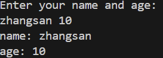

### if语句
注意：
- 不需要用括号将条件包含起来
- 大括号必须存在，即使只有一行语句
- 左括号必须在if或else的同一行
- 在if之后，条件语句中可以添加变量的初始化语句，使用`;`进行分隔（条件语句中声明的变量作用域只在if语句内部，具体可以看[作用域](.//程序结构.md#作用域)）
- 不能使用0或非0表示真假

```Go
func main() {
	if age := 19; age > 18 {
		fmt.Println("You are an adult!")
	} else {
		fmt.Println("You are a minor!")
	}
}
```
> You are an adult!

```Go
func main() {
	a := 0
	if a {
		fmt.Println("a is true")
	}
}
```
> non-boolean condition in if statement


### if else语句
go语言中的if else可以根据给定条件二选一
```Go 
package main

import (
	"fmt"
)

func f1() {
	a := 1
	b := 2
	if a > b {
		fmt.Println("a > b")
	} else {
		fmt.Println("a <= b")
	}
}

func main() {
	f1()
}
```
> a <= b

```Go
package main

import "fmt"

func main() {
	var name string
	var age int

	fmt.Println("Enter your name and age: ")
	fmt.Scan(&name, &age)
	fmt.Printf("name: %v\n", name)
	fmt.Printf("age: %v\n", age)
}
```



### if else if语句
go语言if语句可以进行多重嵌套使用，进行多重判断
```Go
package main

import "fmt"

func main() {
	if x := 5; x > 5 {
		fmt.Println(x)
	} else if y := 5; y == x {
		fmt.Println(x, y)
	} else {
		fmt.Println(x, y)
	}
}
```
> 5 5


### switch语句
go语言中的switch语句，可以非常容易地判断多个值的情况
注意：
- switch后是一个表达式（常量值、变量、一个有返回值的函数等都可以）
- case后的各个值的数据类型必须和switch的表达式数据类型一致
- 支持多条件匹配，使用逗号间隔，比如`case 表达式1, 表达式2...`
- switch后也可以不带表达式，当作if分支来使用
- 不同的case之间不使用break分隔，默认只会执行一个case
- case可以是条件表达式
- fallthrough可以执行满足条件的下一个case，也可用break终止，也叫做switch穿透

```Go
package main

import "fmt"

func f() {
	grade := "A"
	switch grade {
	case "A":
		fmt.Println("Excellent!")
	case "B":
		fmt.Println("Good!")
	case "C":
		fmt.Println("Not bad!")
	case "D":
		fmt.Println("Bad!")
	default:
		fmt.Println("Invalid grade!")
	}
}

func main() {
	f()
}
```
> Excellent!


### for循环语句
go语言中的for循环，只有for关键字，去除了其他语言中的`while`和`do while`
注意：
- for表达式不需要加括号
- 初始条件可以在for表达式外
- 初始条件和结束条件都可以省略
- for循环可以通过`break`、`goto`、`return`、`panic`语句强制退出循环

```Go
package main

import "fmt"

func main() {
	for i := 0; i < 10; i++ {
		fmt.Println(i)
	}
}
```

```Go
package main

import "fmt"

func main() {
    // 初始条件可以在for表达式外
    i := 0
	for ; i < 10; i++ {
		fmt.Println(i)
	}
}
```

```Go
package main

import "fmt"

func main() {
    // 初始条件和结束条件都可以省略
	i := 0  // 初始条件
    for i < 10 {
		fmt.Println(i)
        i++ // 结束条件
	}
}
```

```Go
package main

import "fmt"

func main() {
    // 永真循环
	for {
		fmt.Println("continous...")
	}
}
```


### for range循环语句
go语言中可以使用`for range`遍历数组、切片、字符串、map及通道（channel）
通过`for range`遍历的返回值有以下规律：
- 数组、切片（slice）、字符串返回索引和值
- map返回键和值
- 通道只返回通道内的值

遍历数组
```Go
package main

import "fmt"

func f() {
	var a = []int{1, 2, 3}
	for i, v := range a {
		fmt.Printf("i: %d, v: %d\n", i, v)
	}
}

func main() {
	f()
}
```
> i: 0, v: 1
> i: 1, v: 2
> i: 2, v: 3

遍历map
```Go
package main

import "fmt"

func f() {
	m := make(map[string]string, 0)
	m["name"] = "zhangsan"
	m["age"] = "20"
	m["address"] = "Beijing"

	for key, value := range m {
		fmt.Printf("%v: %v\n", key, value)
	}
}

func main() {
	f()
}
```
> name: zhangsan
> age: 20
> address: Beijing


### break关键字
break语句可以结束`for`、`select`和`switch`的代码块
注意：
- 单独在select中使用break和不使用break没有区别
- 单独在表达式switch语句中，并且没有fallthrough，使用break和不使用break没有区别
- 单独在表达式switch语句中，并且有fallthrough，使用break能够终止fallthrough后面的case语句的执行
- 带标签的break，可以跳出多层select/switch作用域，让break更加灵活，写法更加简单灵活，不需要使用控制变量一层一层跳出循环，没有带break的只能跳出当前语句块

#### 标签和break
可以直接跳出指定的循环
```Go
func main() {
 
LABEL1:
   for i := 0; i < 5; i++ {
      for j := 0; j < 5; j++ {
         if j == 3 {
            break LABEL1
         }
 
         fmt.Println("i:", i, ",j:", j)
      }
   }
   fmt.Println("end------")
}
```
> i: 0 ,j: 0
> i: 0 ,j: 1
> i: 0 ,j: 2
> end------


### continue关键字
continue只能用在循环中，在go中只能用在for循环中，它可以终止本次循环，进行下一次循环。
在continue语句后添加标签时，表示开始标签对应的循环。

#### 标签和continue
会跳到指定的位置，但是会记录之前的状态，i变成1。
```Go
func main() {
LABEL1:
	for i := 1; i <= 3; i++ {
		for j := 0; j <= 3; j++ {
			if i == 2 && j == 2 {
				continue LABEL1
			}
			fmt.Println("i:", i, ",j:", j)
		}
	}
	fmt.Println("end------")
}
```
> i: 1 ,j: 0
> i: 1 ,j: 1
> i: 1 ,j: 2
> i: 1 ,j: 3
> i: 2 ,j: 0
> i: 2 ,j: 1
> i: 3 ,j: 0
> i: 3 ,j: 1
> i: 3 ,j: 2
> i: 3 ,j: 3
> end------


### return关键字
结束当前函数
```Go
func main() {
    for i := 0; i <= 100 ; i++ {
        fmt.Println(i)
        if i == 10 {
            return
        }
    }
    fmt.Println("hello golang")
}
```
> 0
> 1
> 2
> 3
> 4
> 5
> 6
> 7
> 8
> 9
> 10
