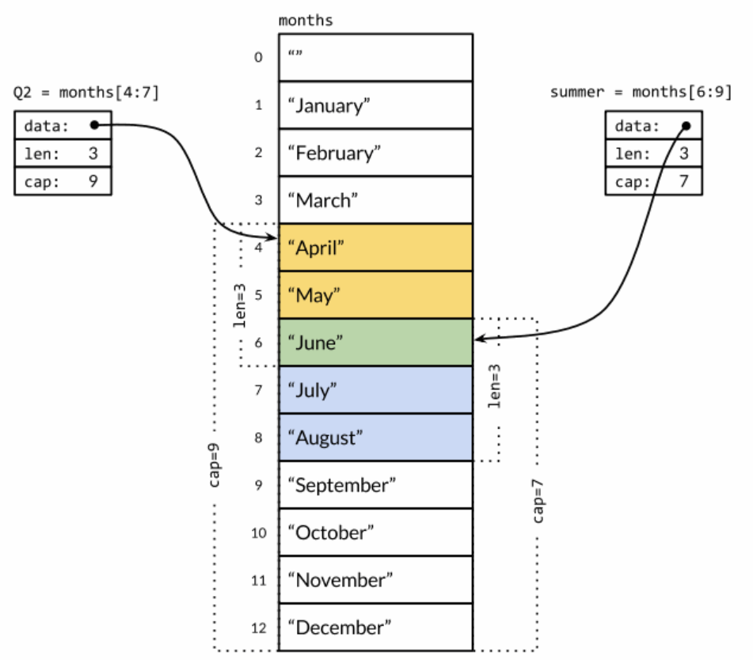

### 数组
数组是一个由固定长度的特定类型元素组成的序列，一个数组可以由零个或多个元素组成。因为数组的长度是固定的，因此在Go语言中很少直接使用数组。和数组对应的类型是Slice（切片），它是可以增长和收缩的动态序列，slice功能也更灵活，但是要理解slice工作原理的话需要先理解数组。

数组的每个元素可以通过索引下标来访问，索引下标的范围是从0开始到数组长度减1的位置。内置的len函数将返回数组中元素的个数。

默认情况下，数组的每个元素都被初始化为元素类型对应的零值，对于数字类型来说就是0。我们也可以使用数组字面值语法用一组值来初始化数组：
```Go
var q [3]int = [3]int{1, 2, 3}
var r [3]int = [3]int{1, 2}
fmt.Println(r[2]) // "0"
```
在数组字面值中，如果在数组的长度位置出现的是“...”省略号，则表示数组的长度是根据初始化值的个数来计算。因此，上面q数组的定义可以简化为
```Go
q := [...]int{1, 2, 3}
fmt.Printf("%T\n", q) // "[3]int"
```

数组的长度是数组类型的一个组成部分，因此[3]int和[4]int是两种不同的数组类型。==数组的长度必须是常量表达式，因为数组的长度需要在编译阶段确定。==
```Go
q := [3]int{1, 2, 3}
q = [4]int{1, 2, 3, 4} // compile error: cannot assign [4]int to [3]int
```

上面的形式是直接提供顺序初始化值序列，但是也可以指定一个索引和对应值列表的方式初始化，就像下面这样：
```Go
type Currency int

const (
    USD Currency = iota // 美元
    EUR                 // 欧元
    GBP                 // 英镑
    RMB                 // 人民币
)

symbol := [...]string{USD: "$", EUR: "€", GBP: "￡", RMB: "￥"}

fmt.Println(RMB, symbol[RMB]) // "3 ￥"
```
在这种形式的数组字面值形式中，初始化索引的顺序是无关紧要的，而且没用到的索引可以省略，和前面提到的规则一样，未指定初始值的元素将用零值初始化。例如，
```Go
r := [...]int{99: -1}
```
定义了一个含有100个元素的数组r，最后一个元素被初始化为-1，其它元素都是用0初始化。

如果一个数组的元素类型是可以相互比较的，那么数组类型也是可以相互比较的，这时候我们可以直接通过==比较运算符来比较两个数组，只有当两个数组的所有元素都是相等的时候数组才是相等的。不相等比较运算符!=遵循同样的规则。

当调用一个函数的时候，函数的每个调用参数将会被赋值给函数内部的参数变量，所以函数参数变量接收的是一个复制的副本，并不是原始调用的变量。因为函数参数传递的机制导致传递大的数组类型将是低效的，并且对数组参数的任何的修改都是发生在复制的数组上，并不能直接修改调用时原始的数组变量。在这个方面，Go语言对待数组的方式和其它很多编程语言不同，其它编程语言可能会隐式地将数组作为引用或指针对象传入被调用的函数。

当然，我们可以显式地传入一个数组指针，那样的话函数通过指针对数组的任何修改都可以直接反馈到调用者。下面的函数用于给`[32]byte`类型的数组清零：
```Go
func zero(ptr *[32]byte) {
    for i := range ptr {
        ptr[i] = 0
    }
}
```
其实数组字面值[32]byte{}就可以生成一个32字节的数组。而且每个数组的元素都是零值初始化，也就是0。因此，我们可以将上面的zero函数写的更简洁一点：
```Go
func zero(ptr *[32]byte) {
    *ptr = [32]byte{}
}
```


### Slice
Slice（切片）代表变长的序列，序列中每个元素都有相同的类型。一个slice类型一般写作`[]T`，其中T代表slice中元素的类型；slice的语法和数组很像，只是没有固定长度而已。

数组和slice之间有着紧密的联系。一个slice是一个轻量级的数据结构，提供了访问数组子序列（或者全部）元素的功能，而且slice的底层确实引用一个数组对象。一个slice由三个部分构成：指针、长度和容量。指针指向第一个slice元素对应的底层数组元素的地址，要注意的是slice的第一个元素并不一定就是数组的第一个元素。长度对应slice中元素的数目；长度不能超过容量，容量一般是从slice的开始位置到底层数据的结尾位置。内置的len和cap函数分别返回slice的长度和容量。

多个slice之间可以共享底层的数据，并且引用的数组部分区间可能重叠。
例：months是一个表示一年中每个月份名字的字符串数组，Q2和summer是两个重叠引用了该数组的Slice。
数组定义：
```Go
months := [...]string{1: "January", /* ... */, 12: "December"}
```
因此一月份是months[1]，十二月份是months[12]。通常，数组的第一个元素从索引0开始，但是月份一般是从1开始的，因此我们声明数组时直接跳过第0个元素，第0个元素会被自动初始化为空字符串。

slice的切片操作`s[i:j]`，其中0 ≤ i≤ j≤ cap(s)，用于创建一个新的slice，==引用s的从第i个元素开始到第j-1个元素的子序列==。新的slice将只有j-i个元素。如果i位置的索引被省略的话将使用0代替，如果j位置的索引被省略的话将使用len(s)代替。因此，months[1:13]切片操作将引用全部有效的月份，和months[1:]操作等价；months[:]切片操作则是引用整个数组。让我们分别定义表示第二季度和北方夏天月份的slice，它们有重叠部分：

```Go
Q2 := months[4:7]
summer := months[6:9]
fmt.Println(Q2)     // ["April" "May" "June"]
fmt.Println(summer) // ["June" "July" "August"]
```

如果切片操作超出cap(s)的上限将导致一个panic异常，但是超出len(s)则是意味着扩展了slice，因为新slice的长度会变大：
```Go
fmt.Println(summer[:20]) // panic: out of range

endlessSummer := summer[:5] // extend a slice (within capacity)
fmt.Println(endlessSummer)  // "[June July August September October]"
```

另外，字符串的切片操作和[]byte字节类型切片的切片操作是类似的。都写作x[m:n]，并且都是返回一个原始字节序列的子序列，底层都是共享之前的底层数组，因此这种操作都是常量时间复杂度。x[m:n]切片操作对于字符串则生成一个新字符串，如果x是[]byte的话则生成一个新的[]byte。

因为slice值包含指向第一个slice元素的指针，因此向函数传递slice将允许在函数内部修改底层数组的元素。换句话说，复制一个slice只是对底层的数组创建了一个新的slice别名。下面的reverse函数在原内存空间将[]int类型的slice反转，而且它可以用于任意长度的slice。
```Go
// reverse reverses a slice of ints in place.
func reverse(s []int) {
    for i, j := 0, len(s)-1; i < j; i, j = i+1, j-1 {
        s[i], s[j] = s[j], s[i]
    }
}
```
反转数组：
```Go
a := [...]int{0, 1, 2, 3, 4, 5}
reverse(a[:])
fmt.Println(a) // "[5 4 3 2 1 0]"
```
反转Slice：
```Go
s := []int{0, 1, 2, 3, 4, 5}
// Rotate s left by two positions.
reverse(s[:2])
reverse(s[2:])
reverse(s)
fmt.Println(s) // "[2 3 4 5 0 1]"
```

要注意的是slice类型的变量s和数组类型的变量a的初始化语法的差异。slice和数组的字面值语法很类似，它们都是用花括弧包含一系列的初始化元素，但是==对于slice并没有指明序列的长度。这会隐式地创建一个合适大小的数组==，然后slice的指针指向底层的数组。就像数组字面值一样，slice的字面值也可以按顺序指定初始化值序列，或者是通过索引和元素值指定，或者用两种风格的混合语法初始化。

==和数组不同的是，slice之间不能比较==，因此我们不能使用==操作符来判断两个slice是否含有全部相等元素。不过标准库提供了高度优化的bytes.Equal函数来判断两个字节型slice是否相等（[]byte），但是对于其他类型的slice，我们必须自己展开每个元素进行比较：
```Go
func equal(x, y []string) bool {
    if len(x) != len(y) {
        return false
    }
    for i := range x {
        if x[i] != y[i] {
            return false
        }
    }
    return true
}
```

slice唯一合法的比较操作是和nil比较，例如：
```Go
if summer == nil { /* ... */ }
```

一个零值的slice等于nil。一个nil值的slice并没有底层数组。一个nil值的slice的长度和容量都是0，但是也有非nil值的slice的长度和容量也是0的，例如[]int{}或make([]int, 3)[3:]。与任意类型的nil值一样，我们可以用[]int(nil)类型转换表达式来生成一个对应类型slice的nil值。
```Go
var s []int    // len(s) == 0, s == nil
s = nil        // len(s) == 0, s == nil
s = []int(nil) // len(s) == 0, s == nil
s = []int{}    // len(s) == 0, s != nil
```

如果你需要测试一个slice是否是空的，使用len(s) == 0来判断，而不应该用s == nil来判断。除了和nil相等比较外，一个nil值的slice的行为和其它任意0长度的slice一样；例如reverse(nil)也是安全的。

内置的make函数创建一个指定元素类型、长度和容量的slice。容量部分可以省略，在这种情况下，容量将等于长度。
```Go
make([]T, len)
make([]T, len, cap) // same as make([]T, cap)[:len]
```
在底层，make创建了一个匿名的数组变量，然后返回一个slice；只有通过返回的slice才能引用底层匿名的数组变量。在第一种语句中，slice是整个数组的view。在第二个语句中，slice只引用了底层数组的前len个元素，但是容量将包含整个的数组。额外的元素是留给未来的增长用的。

#### append函数
内置的append函数用于向Slice追加元素：
```Go
var runes []rune
for _, r := range "Hello, 世界" {
    runes = append(runes, r)
}
fmt.Printf("%q\n", runes) // "['H' 'e' 'l' 'l' 'o' ',' ' ' '世' '界']"
```

通常我们并不知道append调用是否导致了内存的重新分配，因此我们也不能确认新的slice和原始的slice是否引用的是相同的底层数组空间。同样，我们不能确认在原先的slice上的操作是否会影响到新的slice。因此，通常是将append返回的结果直接赋值给输入的slice变量：
```Go
runes = append(runes, r)
```

更新slice变量不仅对调用append函数是必要的，实际上对应任何可能导致长度、容量或底层数组变化的操作都是必要的。要正确地使用slice，需要记住尽管底层数组的元素是间接访问的，但是slice对应结构体本身的指针、长度和容量部分是直接访问的。要更新这些信息需要像上面例子那样一个显式的赋值操作。从这个角度看，slice并不是一个纯粹的引用类型，它实际上是一个类似下面结构体的聚合类型：
```Go
type IntSlice struct {
    ptr      *int
    len, cap int
}
```

#### Slice内存技巧
例：下面的nonempty函数将在原有slice内存空间之上返回不包含空字符串的列表：
```Go
// Nonempty is an example of an in-place slice algorithm.
package main

import "fmt"

// nonempty returns a slice holding only the non-empty strings.
// The underlying array is modified during the call.
func nonempty(strings []string) []string {
    i := 0
    for _, s := range strings {
        if s != "" {
            strings[i] = s
            i++
        }
    }
    return strings[:i]
}
```
输入的slice和输出的slice共享一个底层数组。这可以避免分配另一个数组，不过原来的数据将可能会被覆盖，正如下面两个打印语句看到的那样：
```Go
data := []string{"one", "", "three"}
fmt.Printf("%q\n", nonempty(data)) // `["one" "three"]`
fmt.Printf("%q\n", data)           // `["one" "three" "three"]`
```
因此我们通常会这样使用nonempty函数：
```Go
data = nonempty(data)
```

nonempty函数也可以使用append函数实现：
```Go
func nonempty2(strings []string) []string {
    out := strings[:0] // zero-length slice of original
    for _, s := range strings {
        if s != "" {
            out = append(out, s)
        }
    }
    return out
}
```


### Map
哈希表是一种巧妙并且实用的数据结构。它是一个无序的key/value对的集合，其中所有的key都是不同的，然后通过给定的key可以在常数时间复杂度内检索、更新或删除对应的value。

在Go语言中，一个map就是一个哈希表的引用，map类型可以写为`map[K]V`，其中K和V分别对应key和value。map中所有的key都有相同的类型，所有的value也有着相同的类型，但是key和value之间可以是不同的数据类型。其中K对应的key必须是支持==比较运算符的数据类型，所以map可以通过测试key是否相等来判断是否已经存在。虽然浮点数类型也是支持相等运算符比较的，但是将浮点数用做key类型则是一个坏的想法，正如第三章提到的，最坏的情况是可能出现的NaN和任何浮点数都不相等。对于V对应的value数据类型则没有任何的限制。

#### 创建map
内置的make函数可以创建一个map：
```Go
ages := make(map[string]int) // mapping from strings to ints
ages := make(map[string]int, 10) // specify the length for the map
```

我们也可以用map字面值的语法创建map，同时还可以指定一些最初的key/value：
```Go
ages := map[string]int{
    "alice":   31,
    "charlie": 34,
}
```
这相当于
```Go
ages := make(map[string]int)
ages["alice"] = 31
ages["charlie"] = 34
```

#### 访问元素
Map中的元素通过key对应的下标语法访问：
```Go
ages["alice"] = 32
fmt.Println(ages["alice"]) // "32"
```

#### 删除元素
使用内置的delete函数可以删除元素：
```Go
delete(ages, "alice") // remove element ages["alice"]
```

所有这些操作是安全的，即使这些元素不在map中也没有关系；如果一个查找失败将返回value类型对应的零值，例如，即使map中不存在“bob”下面的代码也可以正常工作，因为ages["bob"]失败时将返回0。
```Go
ages["bob"] = ages["bob"] + 1 // happy birthday!
```

而且x += y和x++等简短赋值语法也可以用在map上，所以上面的代码可以改写成
```Go
ages["bob"] += 1
```
更简单的写法
```Go
ages["bob"]++
```

==但是map中的元素并不是一个变量，因此我们不能对map的元素进行取址操作==：
```Go
_ = &ages["bob"] // compile error: cannot take address of map element
```
禁止对map元素取址的原因是map可能随着元素数量的增长而重新分配更大的内存空间，从而可能导致之前的地址无效。

要想遍历map中全部的key/value对的话，可以使用range风格的for循环实现，和之前的slice遍历语法类似。下面的迭代语句将在每次迭代时设置name和age变量，它们对应下一个键/值对：
```Go
for name, age := range ages {
    fmt.Printf("%s\t%d\n", name, age)
}
```

==Map的迭代顺序是不确定的，并且不同的哈希函数实现可能导致不同的遍历顺序。==在实践中，遍历的顺序是随机的，每一次遍历的顺序都不相同。这是故意的，每次都使用随机的遍历顺序可以强制要求程序不会依赖具体的哈希函数实现。如果要按顺序遍历key/value对，我们必须显式地对key进行排序，可以使用sort包的Strings函数对字符串slice进行排序。下面是常见的处理方式：
```Go
import "sort"

var names []string
for name := range ages {
    names = append(names, name)
}
sort.Strings(names)
for _, name := range names {
    fmt.Printf("%s\t%d\n", name, ages[name])
}
```
因为我们一开始就知道names的最终大小，因此给slice分配一个合适的大小将会更有效。下面的代码创建了一个空的slice，但是slice的容量刚好可以放下map中全部的key：
```Go
names := make([]string, 0, len(ages))
```
在上面的第一个range循环中，我们只关心map中的key，所以我们忽略了第二个循环变量。在第二个循环中，我们只关心names中的名字，所以我们使用“_”空白标识符来忽略第一个循环变量，也就是迭代slice时的索引。

map类型的零值是nil，也就是没有引用任何哈希表。
```Go
var ages map[string]int
fmt.Println(ages == nil)    // "true"
fmt.Println(len(ages) == 0) // "true"
```

map上的大部分操作，包括查找、删除、len和range循环都可以安全工作在nil值的map上，它们的行为和一个空的map类似。但是向一个nil值的map存入元素将导致一个panic异常：
```Go
var ages map[string]int
ages["carol"] = 21 // panic: assignment to entry in nil map
```
==在向map存数据前必须先创建map。==

通过key作为索引下标来访问map将产生一个value。如果key在map中是存在的，那么将得到与key对应的value；如果key不存在，那么将得到value对应类型的零值，正如我们前面看到的ages["bob"]那样。这个规则很实用，但是有时候可能需要知道对应的元素是否真的是在map之中。例如，如果元素类型是一个数字，你可能需要区分一个已经存在的0，和不存在而返回零值的0，可以像下面这样测试：
```Go
age, ok := ages["bob"]
if !ok { /* "bob" is not a key in this map; age == 0. */ }
```
经常可以将这两个结合起来使用：
```Go
if age, ok := ages["bob"]; !ok { /* ... */ }
```
在这种场景下，map的下标语法将产生两个值；第二个是一个布尔值，用于报告元素是否真的存在。布尔变量一般命名为ok，特别适合马上用于if条件判断部分。

和slice一样，map之间也不能进行相等比较；唯一的例外是和nil进行比较。要判断两个map是否包含相同的key和value，我们必须通过一个循环实现：
```Go
func equal(x, y map[string]int) bool {
    if len(x) != len(y) {
        return false
    }
    for k, xv := range x {
        if yv, ok := y[k]; !ok || yv != xv {
            return false
        }
    }
    return true
}
```
从例子中可以看到如何用!ok来区分元素不存在，与元素存在但为0的。我们不能简单地用xv != y[k]判断，因为当找不到相应索引的对应值时会返回对应类型的零值，所以那样会导致在判断下面两个map时产生错误的结果：
```Go
// True if equal is written incorrectly.
equal(map[string]int{"A": 0}, map[string]int{"B": 42})
```

Go程序员将这种忽略value的map当作一个字符串集合，并非所有map[string]bool类型value都是无关紧要的；有一些则可能会同时包含true和false的值。

有时候我们需要一个map或set的key是slice类型，但是map的key必须是可比较的类型，但是slice并不满足这个条件。不过，我们可以通过两个步骤绕过这个限制。第一步，定义一个辅助函数k，将slice转为map对应的string类型的key，确保只有x和y相等时k(x) == k(y)才成立。然后创建一个key为string类型的map，在每次对map操作时先用k辅助函数将slice转化为string类型。

下面的例子演示了如何使用map来记录提交相同的字符串列表的次数。它使用了fmt.Sprintf函数将字符串列表转换为一个字符串以用于map的key，通过%q参数忠实地记录每个字符串元素的信息：
```Go
var m = make(map[string]int)

func k(list []string) string { return fmt.Sprintf("%q", list) }

func Add(list []string)       { m[k(list)]++ }
func Count(list []string) int { return m[k(list)] }
```
使用同样的技术可以处理任何不可比较的key类型，而不仅仅是slice类型。这种技术对于想使用自定义key比较函数的时候也很有用，例如在比较字符串的时候忽略大小写。同时，辅助函数k(x)也不一定是字符串类型，它可以返回任何可比较的类型，例如整数、数组或结构体等。

==Map的value类型也可以是一个聚合类型==，比如是一个map或slice。在下面的代码中，graph这个map的key类型是一个字符串，value类型map[string]bool代表一个字符串集合。从概念上讲，graph将一个字符串类型的key映射到一组相关的字符串集合，它们指向新的graph的key。
```Go
var graph = make(map[string]map[string]bool)

func addEdge(from, to string) {
    edges := graph[from]
    if edges == nil {
        edges = make(map[string]bool)
        graph[from] = edges
    }
    edges[to] = true
}

func hasEdge(from, to string) bool {
    return graph[from][to]
}
```
其中addEdge函数惰性初始化map是一个惯用方式，也就是说在每个值首次作为key时才初始化。hasEdge函数显示了如何让map的零值也能正常工作；即使from到to的边不存在，`graph[from][to]`依然可以返回一个有意义的结果。


### 结构体
结构体是一种聚合的数据类型，是由零个或多个任意类型的值聚合成的实体。每个值称为结构体的成员。用结构体的经典案例是处理公司的员工信息，每个员工信息包含一个唯一的员工编号、员工的名字、家庭住址、出生日期、工作岗位、薪资、上级领导等等。所有的这些信息都需要绑定到一个实体中，可以作为一个整体单元被复制，作为函数的参数或返回值，或者是被存储到数组中，等等。

下面两个语句声明了一个叫Employee的命名的结构体类型，并且声明了一个Employee类型的变量dilbert：
```Go
type Employee struct {
    ID        int
    Name      string
    Address   string
    DoB       time.Time
    Position  string
    Salary    int
    ManagerID int
}

var dilbert Employee
```
dilbert结构体变量的成员可以通过==点操作符==访问，比如dilbert.Name和dilbert.DoB。因为dilbert是一个变量，它所有的成员也同样是变量，我们可以直接对每个成员赋值：
```Go
dilbert.Salary -= 5000 // demoted, for writing too few lines of code
```
或者是对成员取地址，然后通过指针访问：
```Go
position := &dilbert.Position
*position = "Senior " + *position // promoted, for outsourcing to Elbonia
```
点操作符也可以和指向结构体的指针一起工作：
```Go
var employeeOfTheMonth *Employee = &dilbert
employeeOfTheMonth.Position += " (proactive team player)"
```
相当于
```Go
(*employeeOfTheMonth).Position += " (proactive team player)"
```

下面的EmployeeByID函数将根据给定的员工ID返回对应的员工信息结构体的指针。我们可以使用点操作符来访问它里面的成员：
```Go
func EmployeeByID(id int) *Employee { /* ... */ }

fmt.Println(EmployeeByID(dilbert.ManagerID).Position) // "Pointy-haired boss"

id := dilbert.ID
EmployeeByID(id).Salary = 0 // fired for... no real reason
```
后面的语句通过EmployeeByID返回的结构体指针更新了Employee结构体的成员。如果将EmployeeByID函数的返回值从*Employee指针类型改为Employee值类型，那么更新语句将不能编译通过，因为在赋值语句的左边并不确定是一个变量（调用函数返回的是值，并不是一个可取地址的变量，在Go语言中的值类型是不可寻址的，所以不能直接对返回值进行修改）。

通常一行对应一个结构体成员，成员的名字在前类型在后，不过如果相邻的成员类型如果相同的话可以被合并到一行，就像下面的Name和Address成员那样：
```Go
type Employee struct {
    ID            int
    Name, Address string
    DoB           time.Time
    Position      string
    Salary        int
    ManagerID     int
}
```
结构体成员的输入顺序也有重要的意义。我们也可以将Position成员合并（因为也是字符串类型），或者是交换Name和Address出现的先后顺序，那样的话就是定义了不同的结构体类型。通常，我们只是将相关的成员写到一起。

如果结构体成员名字是以大写字母开头的，那么该成员就是导出的；这是Go语言导出规则决定的。一个结构体可能同时包含导出和未导出的成员。

一个命名为S的结构体类型将不能再包含S类型的成员：因为一个聚合的值不能包含它自身。（该限制同样适用于数组。）但是S类型的结构体可以包含*S指针类型的成员，这可以让我们创建递归的数据结构，比如链表和树结构等。在下面的代码中，我们使用一个二叉树来实现一个插入排序：
```Go
type tree struct {
    value       int
    left, right *tree
}

// Sort sorts values in place.
func Sort(values []int) {
    var root *tree
    for _, v := range values {
        root = add(root, v)
    }
    appendValues(values[:0], root)
}

// appendValues appends the elements of t to values in order
// and returns the resulting slice.
func appendValues(values []int, t *tree) []int {
    if t != nil {
        values = appendValues(values, t.left)
        values = append(values, t.value)
        values = appendValues(values, t.right)
    }
    return values
}

func add(t *tree, value int) *tree {
    if t == nil {
        // Equivalent to return &tree{value: value}.
        t = new(tree)
        t.value = value
        return t
    }
    if value < t.value {
        t.left = add(t.left, value)
    } else {
        t.right = add(t.right, value)
    }
    return t
}
```

==结构体类型的零值是每个成员都是零值。==通常会将零值作为最合理的默认值。例如，对于bytes.Buffer类型，结构体初始值就是一个随时可用的空缓存，还有sync.Mutex的零值也是有效的未锁定状态。有时候这种零值可用的特性是自然获得的，但是也有些类型需要一些额外的工作。

如果结构体没有任何成员的话就是空结构体，写作struct{}。它的大小为0，也不包含任何信息，但是有时候依然是有价值的。有些Go语言程序员用map来模拟set数据结构时，用它来代替map中布尔类型的value，只是强调key的重要性，但是因为节约的空间有限，而且语法比较复杂，所以我们通常会避免这样的用法。
```Go
seen := make(map[string]struct{}) // set of strings
// ...
if _, ok := seen[s]; !ok {
    seen[s] = struct{}{}
    // ...first time seeing s...
}
```

#### 结构体字面量
结构体值也可以用结构体字面值表示，结构体字面值可以指定每个成员的值。
```Go
type Point struct{ X, Y int }

p := Point{1, 2}
```
这里有两种形式的结构体字面值语法，上面的是第一种写法，要求以结构体成员定义的顺序为每个结构体成员指定一个字面值。它要求写代码和读代码的人要记住结构体的每个成员的类型和顺序，不过结构体成员有细微的调整就可能导致上述代码不能编译。因此，上述的语法一般只在定义结构体的包内部使用，或者是在较小的结构体中使用，这些结构体的成员排列比较规则，比如image.Point{x, y}或color.RGBA{red, green, blue, alpha}。

更常用的是第二种写法，以成员名字和相应的值来初始化，可以包含部分或全部的成员，如Lissajous程序的写法：
```Go
anim := gif.GIF{loopCount: nframes}
```
在这种形式的结构体字面值写法中，如果成员被忽略的话将默认用零值。因为提供了成员的名字，所以成员出现的顺序并不重要。

两种不同形式的写法不能混合使用。而且，你不能企图在外部包中用第一种顺序赋值的技巧来偷偷地初始化结构体中未导出的成员。
```Go
package p
type T struct{ a, b int } // a and b are not exported

package q
import "p"
var _ = p.T{a: 1, b: 2} // compile error: can't reference a, b
var _ = p.T{1, 2}       // compile error: can't reference a, b
```

结构体可以作为函数的参数和返回值。例如，这个Scale函数将Point类型的值缩放后返回：
```Go
func Scale(p Point, factor int) Point {
    return Point{p.X * factor, p.Y * factor}
}

fmt.Println(Scale(Point{1, 2}, 5)) // "{5 10}"
```

如果考虑效率的话，较大的结构体通常会用指针的方式传入和返回
```Go
func Bonus(e *Employee, percent int) int {
    return e.Salary * percent / 100
}
```

如果要在函数内部修改结构体成员的话，用指针传入是必须的；==因为在Go语言中，所有的函数参数都是值拷贝传入的，函数参数将不再是函数调用时的原始变量==。

因为结构体通常通过指针处理（通过结构体指针时，可以和正常结构体实例一样使用，因为底层编译器做了优化，底层会自动帮我们加上&和*），可以用下面的写法来创建并初始化一个结构体变量，并返回结构体的地址：
```Go
pp := &Point{1, 2}
```
它和下面的语句是等价的
```Go
pp := new(Point)
*pp = Point{1, 2}
```
不过&Point{1, 2}写法可以直接在表达式中使用，比如一个函数调用

#### 结构体比较
如果结构体的全部成员都是可以比较的，那么结构体也是可以比较的，那样的话两个结构体将可以使用==或!=运算符进行比较。相等比较运算符==将比较两个结构体的每个成员，因此下面两个比较的表达式是等价的：
```Go
type Point struct{ X, Y int }

p := Point{1, 2}
q := Point{2, 1}
fmt.Println(p.X == q.X && p.Y == q.Y) // "false"
fmt.Println(p == q)                   // "false"
```

可比较的结构体类型和其他可比较的类型一样，可以用于map的key类型。
```Go
type address struct {
    hostname string
    port     int
}

hits := make(map[address]int)
hits[address{"golang.org", 443}]++
```

==结构体进行type重新定义（相当于起别名），Go语言会认为其是新的数据类型，但是可以强转==

#### 结构体嵌入和匿名成员
使用Go语言提供的不同寻常的结构体嵌入机制让一个命名的结构体包含另一个结构体类型的匿名成员，这样就可以通过简单的点运算符x.f来访问匿名成员链中嵌套的x.d.e.f成员。

例：考虑一个二维的绘图程序，提供了一个各种图形的库，例如矩形、椭圆形、星形和轮形等几何形状。这里是其中两个的定义：
```Go
type Circle struct {
    X, Y, Radius int
}

type Wheel struct {
    X, Y, Radius, Spokes int
}
```

一个Circle代表的圆形类型包含了标准圆心的X和Y坐标信息，和一个Radius表示的半径信息。一个Wheel轮形除了包含Circle类型所有的全部成员外，还增加了Spokes表示径向辐条的数量。我们可以这样创建一个wheel变量：
```Go
var w Wheel
w.X = 8
w.Y = 8
w.Radius = 5
w.Spokes = 20
```

随着库中几何形状数量的增多，我们一定会注意到它们之间的相似和重复之处，所以我们可能为了便于维护而将相同的属性独立出来：
```Go
type Point struct {
    X, Y int
}

type Circle struct {
    Center Point
    Radius int
}

type Wheel struct {
    Circle Circle
    Spokes int
}
```

Go语言有一个特性让我们只声明一个成员对应的数据类型而不指名成员的名字；这类成员就叫*匿名成员*。匿名成员的数据类型必须是命名的类型或指向一个命名的类型的指针。下面的代码中，Circle和Wheel各自都有一个匿名成员。我们可以说Point类型被嵌入到了Circle结构体，同时Circle类型被嵌入到了Wheel结构体。
```Go
type Circle struct {
    Point
    Radius int
}

type Wheel struct {
    Circle
    Spokes int
}
```
得益于匿名嵌入的特性，我们可以直接访问叶子属性而不需要给出完整的路径：
```Go
var w Wheel
w.X = 8            // equivalent to w.Circle.Point.X = 8
w.Y = 8            // equivalent to w.Circle.Point.Y = 8
w.Radius = 5       // equivalent to w.Circle.Radius = 5
w.Spokes = 20
```
在右边的注释中给出的显式形式访问这些叶子成员的语法依然有效，因此匿名成员并不是真的无法访问了。其中匿名成员Circle和Point都有自己的名字——就是命名的类型名字——但是这些名字在点操作符中是可选的。我们在访问子成员的时候可以忽略任何匿名成员部分。

结构体字面值并没有简短表示匿名成员的语法， 因此下面的语句都不能编译通过：
```Go
w = Wheel{8, 8, 5, 20}                       // compile error: unknown fields
w = Wheel{X: 8, Y: 8, Radius: 5, Spokes: 20} // compile error: unknown fields
```

结构体字面值必须遵循形状类型声明时的结构，所以我们只能用下面的两种语法，它们彼此是等价的：
```Go
w = Wheel{Circle{Point{8, 8}, 5}, 20}

w = Wheel{
    Circle: Circle{
        Point:  Point{X: 8, Y: 8},
        Radius: 5,
    },
    Spokes: 20, // NOTE: trailing comma necessary here (and at Radius)
}

fmt.Printf("%#v\n", w)
// Output:
// Wheel{Circle:Circle{Point:Point{X:8, Y:8}, Radius:5}, Spokes:20}

w.X = 42

fmt.Printf("%#v\n", w)
// Output:
// Wheel{Circle:Circle{Point:Point{X:42, Y:8}, Radius:5}, Spokes:20}
```
需要注意的是Printf函数中%v参数包含的#副词，它表示用和Go语言类似的语法打印值。对于结构体类型来说，将包含每个成员的名字。

==因为匿名成员也有一个隐式的名字，因此不能同时包含两个类型相同的匿名成员，这会导致名字冲突。==同时，因为成员的名字是由其类型隐式地决定的，所以匿名成员也有可见性的规则约束。在上面的例子中，Point和Circle匿名成员都是导出的。即使point和circle不导出，我们仍然可以使用简短形式来访问w.X，但是像注释中的那种长形式（w.circle.point.X）会在外部包中被禁止，因为你无法访问到circle和point。

#### 创建结构体实例的方法总结：
```Go
package main

import "fmt"

type Student struct {
	Name string
	Age  int
}

func main() {
	// 方式1：按照顺序赋值操作
	var s1 Student = Student{"ZhangSan", 20}
	fmt.Println(s1)

	// 方式2：按照指定类型
	var s2 Student = Student{
		Name: "ZhangSan",
		Age:  20,
	}
	fmt.Println(s2)

	// 方式3：想要返回结构体的指针类型
	var s3 *Student = &Student{"ZhangSan", 20}
	fmt.Println(*s3)
	var s4 *Student = &Student{
		Name: "ZhangSan",
		Age:  20,
	}
	fmt.Println(*s4)

	// 方式4：通过new函数创建
	s5 := new(Student)
	*s5 = Student{"ZhangSan", 20}
	fmt.Println(*s5)
}
```
> {ZhangSan 20}
> {ZhangSan 20}
> {ZhangSan 20}
> {ZhangSan 20}
> {ZhangSan 20}


#### 工厂模式
当想跨包创建结构体实例，但是结构体只能在本包访问，可以通过工厂模式（类似构造函数）进行创建结构体实例
```Go
// test_struct/pkg
package pkg

type student struct {
	Name string
	Age  int
}

// 工厂模式
func NewStudent(name string, age int) *student {
	return &student{name, age}
}
```
```Go
// main.go
package main

import (
	"fmt"
	"test_struct/pkg"
)

func main() {
	stu := pkg.NewStudent("ZhangSan", 20)
	fmt.Println(*stu)
}
```