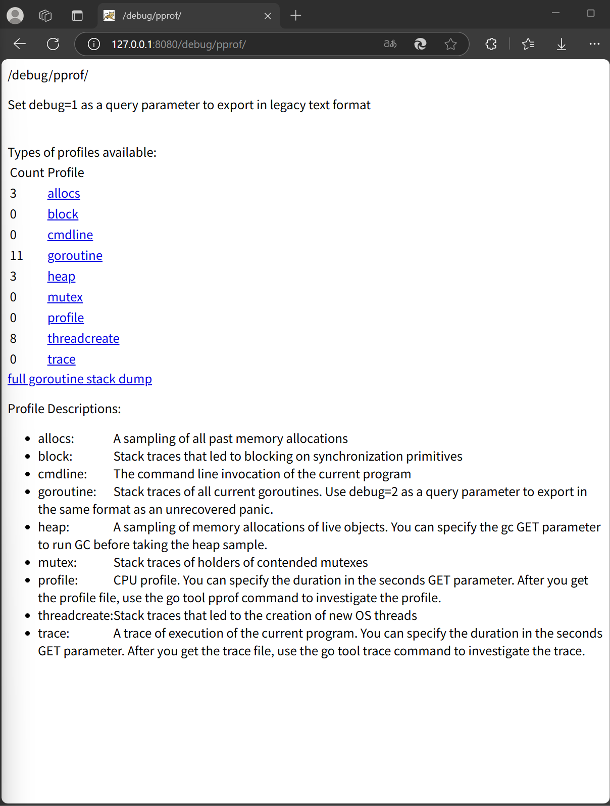
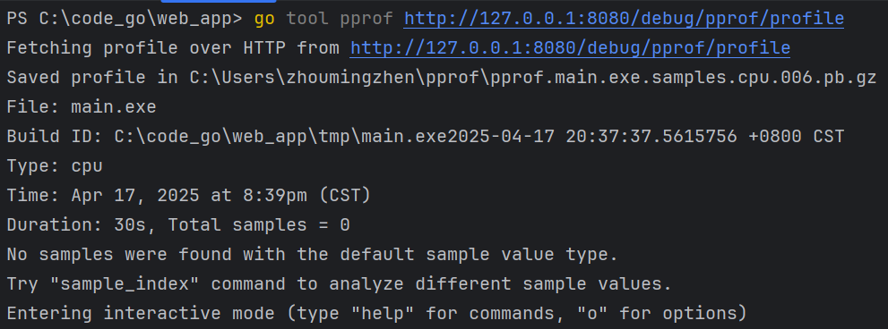
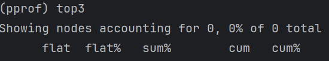

### 性能优化
Go语言项目中的性能优化主要有以下方面：
- CPU profile：报告程序的CPU使用情况，按照一定频率取采集应用程序在CPU和寄存器上面的数据
- Memory Profile（Heap Profile）：报告程序的内存使用情况
- Block Profiling：报告goroutines不在运行状态的情况，可以用来分析和查找死锁等性能瓶颈
- Goroutine Profile：报告goroutines的使用情况，有哪些goroutine，它们的调用关系是怎样的

#### 采集性能数据
Go语言中内置了获取程序的运行数据的工具，包括以下两个标准库：
- `runtime/pprof`：采集工具型应用运行数据进行分析
- `net/http/pprof`：采集服务型应用运行时数据进行分析

pprof开启后，每隔一段时间（10ms）就会收集下当前的额堆栈信息，获取各个函数占用的CPU以及内存资源；最后通过对这些采样数据进行分析，形成一个性能分析报告。

==我们只应该在性能测试的时候才在代码中引入pprof==

#### 工具型应用
如果你的应用程序是运行一段时间就结束退出类型。那么最好的方法是在应用退出的时候把profiling的报告保存到文件中，进行分许。对于这种情况，可以使用`runtime/pprof`库。首先在代码中导入`runtime/pprof`工具：`import "runtime/pprof"`

##### CPU性能分析
开启CPU性能分析：
```Go
pprof.StartCPUProfile(w io.Writer)
```
停止CPU性能分析：
```Go
pprof.StopCPUProfile()
```
应用执行结束后，就会生成一个文件，保存了我们的CPU profiling数据。得到采样数据之后，使用`go tool pprof`工具进行CPU性能分析。

##### 内存性能优化
记录程序的堆栈信息
```Go
pprof.WriteHeapProfile(w io.Writer)
```
得到采样数据之后，使用`go tool pprof`工具进行内存性能分析。
`go tool pprof`默认是使用`-inuse_space`进行统计，还可以使用`-inuse-objects`查看分配对象的数量。

#### 服务型应用
如果你的应用程序是一直运行的，如web应用，那么可以使用`net/http/pprof`库，它能够在提供HTTP服务进行分析。

如果使用了默认的`http.DefaultServeMux`（通常是代码直接使用http.ListenAndServe("0.0.0.0:8000", nil)），只需要你的web serve端代码中按如下方式导入`net/http/pprof`
```Go
import _ "net/http/pprof"
```

如果使用自定义的Mux，则需要手动注册一些路由规则：
```Go
r.HandleFunc("/debug/pprof/", pprof.Index)
r.HandleFunc("/debug/pprof/cmdline", pprof.Cmdline)
r.HandleFunc("/debug/pprof/profile", pprof.Profile)
r.HandleFunc("/debug/pprof/symbol", pprof.Symbol)
r.HandleFunc("/debug/pprof/trace", pprof.Trace)
```

如果使用的是gin框架，推荐使用`github.com/gin-contrib/pprof`，在代码中通过以下命令注册pprof相关路由。
```Go
pprof.Register(router)
```

不管哪种方式，你的HTTP服务都会多出`/debug/pprof`这个地址，访问它会得到类似下面的内容：


这个路径下还有几个子页面：
- `/debug/pprof/profile`：访问这个链接会自动进行CPU profiling，持续30s，并生成一个文件供下载
- `/debug/pprof/heap`：Memory Profiling的路径，访问这个链接会得到一个内存Profiling结果的文件
- `/debug/pprof/block`：block Profiling的路径
- `/debug/pprof/goroutines`：运行的goroutines列表，以及调用关系

##### go tool pprof命令
不管是工具型应用还是服务型应用，我们使用相应的pprof库获取数据之后，下一步都是要对这些数据进行分析，我们可以使用`go tool pprof`命令行工具。

最简单的使用方式：
`go tool pprof [binary] [source]`
其中：
- binary是应用的二进制文件，用来解析各种符号
- source表示profile数据的来源，可以是本地的文件，也可以是http地址

注意：获取的Profiling数据是动态的，要想获得有效的数据，请保证应用处于较大的负载（比如正在生成中运行的服务，或者通过其他工具模拟访问压力）。否则如果应用处于空闲状态，得到的结果可能没有任何意义。

###### 命令行交互界面
使用`pprof`：`go tool pprof http://127.0.0.1:8080/debug/pprof/profile`

执行上面的代码会进入交互界面如下：

我们可以在交互界面输入`top3`来查看程序中占用CPU前3位的函数：

其中：
- flat：当前函数占用CPU的耗时
- flat%：:当前函数占用CPU的耗时百分比
- sun%：函数占用CPU的耗时累计百分比
- cum：当前函数加上调用当前函数的函数占用CPU的总耗时
- cum%：当前函数加上调用当前函数的函数占用CPU的总耗时百分比
- 最后一列：函数名称

我们还可以使用`list 函数名`命令查看具体的函数分析，例如执行`list logicCode`查看我们编写的函数的详细分析。

###### 图形化
或者可以直接输入web，通过svg图的方式查看程序中详细的CPU占用情况。 想要查看图形化的界面首先需要安装graphviz图形化工具。

关于图形的说明： 每个框代表一个函数，理论上框的越大表示占用的CPU资源越多。 方框之间的线条代表函数之间的调用关系。 线条上的数字表示函数调用的次数。 方框中的第一行数字表示当前函数占用CPU的百分比，第二行数字表示当前函数累计占用CPU的百分比。

除了分析CPU性能数据，pprof也支持分析内存性能数据。比如，使用下面的命令分析http服务的heap性能数据，查看当前程序的内存占用以及热点内存对象使用的情况。

```
# 查看内存占用数据
go tool pprof -inuse_space http://127.0.0.1:8080/debug/pprof/heap
go tool pprof -inuse_objects http://127.0.0.1:8080/debug/pprof/heap
# 查看临时内存分配数据
go tool pprof -alloc_space http://127.0.0.1:8080/debug/pprof/heap
go tool pprof -alloc_objects http://127.0.0.1:8080/debug/pprof/heap
```